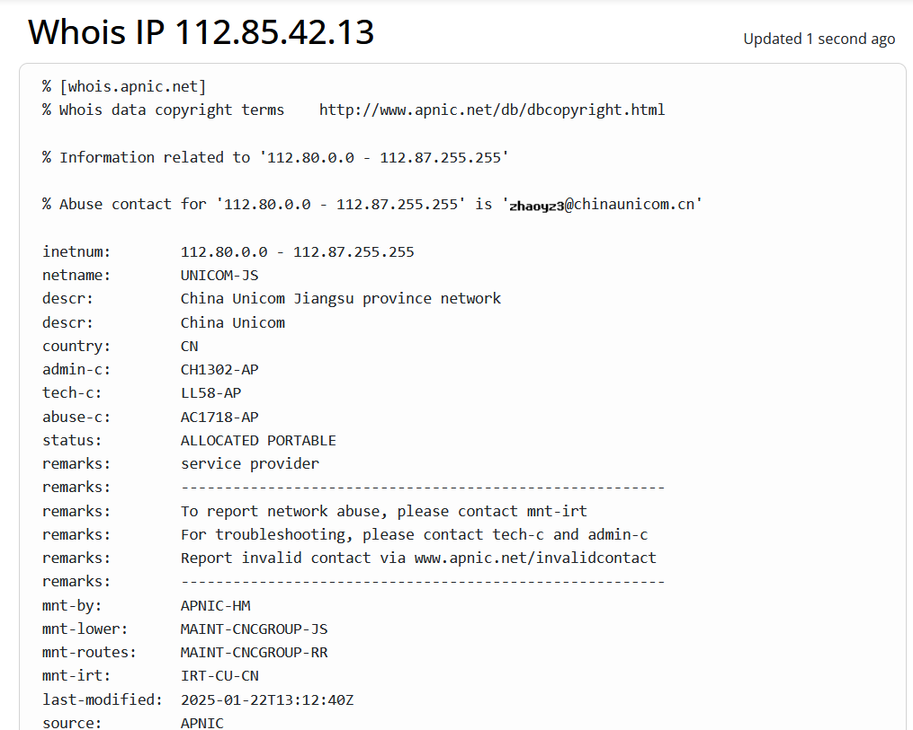
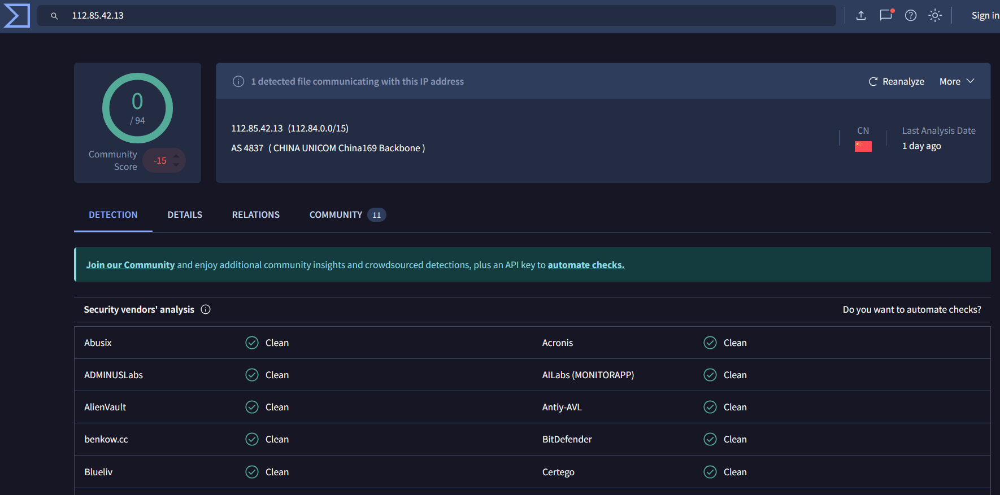
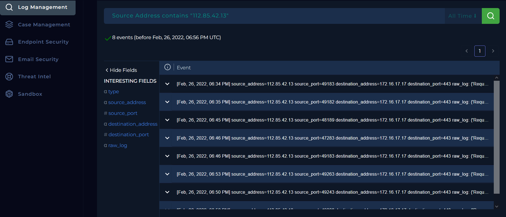

# 116 - SOC166 - Javascript Code Detected in Requested URL — SOC Alert Writeup

<!-- Archivo: LD-YYYYMMDD-SOC-nombre-del-caso.md -->

---

## Metadata

| Campo | Valor |
|---|---|
| **Plataforma** | LetsDefend |
| **Categoría** | SOC Alert |
| **Alert ID** | 116 |
| **Regla disparada** | SOC166 - Javascript Code Detected in Requested URL |
| **Fecha de la alerta** | Feb, 26, 2022, 06:56 PM |
| **Fecha del análisis** | 2026-03-19 |
| **Severidad** | MEDIUM |
| **Veredicto final** | True Positive |
| **Escalado** | No |
| **Tiempo invertido** | ~30 min |

### Herramientas utilizadas

`LetsDefend Log Management` · `LetsDefend Endpoint Security` · `LetsDefend Email Security` · `CyberChef` · `WHOIS` · `VirusTotal` · `AbuseIPDB`

### MITRE ATT&CK

| ID | Técnica | Táctica |
|---|---|---|
| T1059  | Command and Scripting Interpreter | Ejecución de Código Malicioso |

---

## Resumen Ejecutivo

> Un actor externo desde la IP 112.85.42[.]13 realizo múltiples solicitudes HTTP dirigidas al endpoint `/search/` las cuáles contenían patrones típicos de **Cross-Site Scripting (XSS)** en el parámetro `q`. El tráfico corresponde a intentos de inyección de código JavaScript. No se encontró evidencia ejecución ni de explotación exitosa, ya que todas las respuestas del servidor fueron redireccionadas (HTTP 302) sin contenido procesado.
El evento se clasifica como intento de ataque malicioso (**True Positive**) sin impacto confirmado en el sistema.

---

## 1. Triage Inicial

### Información de la alerta

| Campo | Detalle |
|---|---|
| Dispositivo de origen | IP externa|
| IP de origen | 112.85.42[.]13 |
| IP de destino | 172.16.17[.]17 |
| Hostname de destino | WebServer1002 |
| Usuario involucrado | N/A |
| Proceso / Aplicación | Web Server (HTTPS/443) |
| Método HTTP | GET |
| URL solicitada | `https://172.16.17[.]17/search/?q=<$script>javascript:$alert(1)<$/script>` |
| User-Agent | Mozilla/5.0 (Windows NT 6.1; WOW64; rv:40.0) Gecko/20100101 Firefox/40.1 |
| Alert Trigger reason | Código Javascript en la URL |
| Timestamp | Feb, 26, 2022, 06:56 PM |


**Event Details:**


### Primera hipótesis

> La alerta fue disparada por la presencia del patron `<script>` en el parámetro `q` de la URL. El payload indica un intento de Cross-Site Scripting (XSS) contra el endpoint `/search/` de `WebServer1002`. El tráfico proviene de una IP externa (fuente conectada a internet), lo que sugiere que no tiene ningún origen interno. Todas las solicitudes HTTP observadas retornaron respuestas 302 sin evidencia de ejecución de payload y reflexión. 

---

## 2. Recolección de Evidencia

### Verificación de la IP de origen
La ip `112.85.42[.]13` corresponde a una dirección pública de China según los resultados obtenidos WHOIS. Según AbuseIPDB, la dirección IP analizada tiene una puntuación de 0%, lo que implica que carece de reportes negativos y tiene reputación positiva. Añadiendo a este análsisis, los resultados de VirusTotal muestra que la dirección IP `112.85.42[.]13`, tiene una puntuación de 0/94, indicando que no existen detecciones conocidas por el momento. Por otro lado, se verificó que no pertenece a ningún activo interno de la empresa ni herramientas de simulación de ataque (Verodin, AttackIQ, Picus). No se encontró ningun correo electrónico o algun registro de trabajo planificado asociado a esta IP.

**WHOIS lookup:**




**VirusTotal analysis:**



### Logs relevantes 

La búsqueda se realizo en el **Log Managment** con la dirección IP de origen como filtro, a continuación se muestran los logs ordenados cronologicamente:
```text
[LOG 1] Feb, 26, 2022, 06:46 PM
Request URL  : https://172.16.17.17/search/?q=prompt(8)
Method       : GET
Response     : 302 — 0 bytes
Device Action: Permitted
Observación  : Prueba inicial de XSS — inyección de funciónes JavaScript.


[LOG 2] Feb, 26, 2022, 06:46 PM
Request URL  : https://172.16.17.17/search/?q=<$img%20src%20=q%20onerror=prompt(8)$>
Method       : GET
Response     : 302 — 0 bytes
Device Action: Permitted
Observación  : Payload XSS basada en eventos que utiliza el controlador de error <<onerror>> de SVG.


[LOG 3] Feb, 26, 2022, 06:50 PM
Request URL  : https://172.16.17.17/search/?q=<$script>$for((i)in(self))eval(i)(1)<$/script>
Method       : GET
Response     : 302 — 0 bytes
Device Action: Permitted
Observación  : Payload XSS que busca ejecutar dinamicamente funciones disponibles en el contexto de la aplicación web del endpoint objetivo. 


[LOG 4] Feb, 26, 2022, 06:53 PM
Request URL  : https://172.16.17.17/search/?q=<$svg><$script%20?>$alert(1)
Method       : GET
Response     : 302 — 0 bytes
Device Action: Permitted
Observación  : Payload XSS que intenta iniciar la ejecución de un script y busca ejecutar una alerta a través de elementos SVG, con el fin de evadir filtros y seguridad.


[LOG 5] Feb, 26, 2022, 06:56 PM
Request URL  : https://172.16.17.17/search/?q=<$script>javascript:$alert(1)
Method       : GET
Response     : 302 — 0 bytes
Device Action: Permitted
Observación  : Intento directo de ejecución de código JavaScript, tratando de mostrar una alerta con se carga la página, confirmando dicho script. 
```

> **OBSERVACIÓN**: Los payloads analizados en los registros tienen una particularidad, que todos tienen el caracter especial de dolar `$` entre sus sintaxis. Entonces la estructura de cada payload que lleva el signo "$" tiene una estructura no estándar para etiquetas HTML o JavaScript, por lo que tiene una menor probabilidad de ser efectivo en la práctica. Cabe la posibilidad que LetsDefend haya modificado los paylods con fines educativos.  

**Web logs:**




---


## 3. Análisis

### 3.1 Análisis de red / tráfico

| Timestamp | URL decodificada | HTTP Status | Response Size | Observación |
|---|---|---|---|---|
| 06:46 PM | `https://172.16.17[.]17/search/?q=prompt(8)` | 302 | 0 | Sondeo de ejecución de scripts JavaScript malicioso |
| 06:46 PM | `https://172.16.17[.]17/search/?q=<$img src =q onerror=prompt(8)$>` | 302 | 0 | Comprobación de vulnerabilidades XSS al inyectar código JavaScript que se activa cuando hay un error en la carga de la imagen |
| 06:50 PM | `https://172.16.17[.]17/search/?q=<$script>$for((i)in(self))eval(i)(1)<$/script>` | 302 | 0 | Ejecución de funciones globales al llamar eval(i)(1) |
| 06:53 PM | `https://172.16.17[.]17/search/?q=<$svg><$script ?>$alert(1)` | 302 | 0 | Sondeo de XSS al intentar ejecutar alert(1) cuando se carga el elemento SVG |
| 06:56 PM | `https://172.16.17[.]17/search/?q=<$script>javascript:$alert(1)` | 302 | 0 | Sondeo de XSS al ejecutar alert(1) |

El response size constante de **0 bytes** en todos los intentos de ejecución de scripts maliciosos o XSS, sugiere que el servidor no realizo una ejecución visible ni mostró contenido que se pueda analizar. Además la respuesta del servidor con **302**, indica redirección sin intención de ejecución.

### 3.2 Análisis de payload

| Payload  | Descripción | Objetivo |
|---|---|---|
|`https://172.16.17[.]17/search/?q=prompt(8)`| Intenta ejecutar `prompt(8)` para mostrar un cuadro de diálogo. | Verificar vulnerabilidades XSS mediante ejecución de código. |
| `https://172.16.17[.]17/search/?q=<$img src=q onerror=prompt(8)$` | Utiliza un elemento `` con `onerror` para ejecutar `prompt(8)`. | Explotar XSS a través de errores en la carga de imágenes. |
| `https://172.16.17[.]17/search/?q=<script>for((i)in(self))eval(i)(1)</script>` | Ejecuta un ciclo sobre propiedades del objeto `self` usando `eval`. | Ejecutar código arbitrario y comprobar vulnerabilidades. |
| `https://172.16.17[.]17/search/?q=<svg><script ?>alert(1)` | Inyecta un script en un elemento SVG para ejecutar `alert(1)` | Comprobar si la aplicación es vulnerable a XSS. |
| `https://172.16.17[.]17/search/?q=<script>javascript:alert(1)` | Utiliza `<script>` para ejecutar `alert(1)` directamente. | Testear la seguridad contra inyecciones de scripts. |


Todos los payloads registrados tiene como objetivo comprobar la existencia de vulnerabilidades XSS en el endpoint `/search/` modificando el parámetro `q`. Utilizan diferentes enfoques y estructura, desde funciones simple `alert` y `prompt` hasta técnicas más complejas como la iteración sobre propiedades del objeto `self`. 

### 3.3 Verificación de las actividades planificada

De acuerdos a los registros, se verificó que la dirección IP 112.85.42[.]13 no corresponde a ninguna herramienta de simulación de ataques. Se reviso en Email Security y no existen registros de correo electrónicos que muestren algún trabajo planificado relacionado a dicho host. Por lo que el tráfico no es resultado de un pentest autorizado, sino proveniente de internet.

## 4. Determinación del Veredicto

### ¿True Positive o False Positive?

**Veredicto:** True Positive

**Justificación:**
> El tráfico detectado contiene indicadores de un intento malicioso de Cross-Site Scripting (XSS). La solicitud HTTP incluye patrones relacionados a JavaScript tales como `<script>` y `alert(1)` dentro del parámetro `q`, lo cuál es comunmente usado en intentos XSS. El ataque no fue exitoso, todos los payloads retornaron HTTP 302 con response size de 0 bytes, sin evidencia clara de la respuesta a la ejecución de los scripts en la aplicación web.

### Decisión de escalado

- No requiere escalado — caso cerrado

Razón: El ataque provino de internet, no fue exitoso y no hubo compromiso de ningún dispotivo interno.

---

## 5. Indicadores de Compromiso (IOCs)

| Tipo | Valor | Contexto |
|---|---|---|
| IP | `112.85.42[.]13` | Dirección IP que realizó repetidos intentos de inyección XSS contra el endpoint `/search/` |
| URL | `https://172.16.17.17/search` | Endpoint web atacado con múltiples cargas útiles XSS en el parámetro `q`|
| URL | `https://172.16.17[.]17/search/?q=prompt(8)` | Intento de sondaje XSS mediante la inyección de funciones JavaScript |
| URL | `https://172.16.17.17/search/?q=<script>alert(1)</script>` | Payload de intento de inyección de código típica de las pruebas de XSS |
| URL | `https://172.16.17.17/search/?q=<svg/onerror=alert(1)>` | Payload XSS basada en eventos que utiliza el controlador de error «onerror» de SVG|
| Hostname | WebServer1002 | Servidor web objetivo


> Todos los IOCs están defangeados.

---

## 6. Hallazgos Clave

1. **1. Actividad progresiva con indicios de interacción manual**: Se observó una secuencia de solicitudes distribuidas en un intervalo de aproximadamente 10 minutos (06:46 PM – 06:56 PM), con variaciones en los payloads XSS utilizados. La baja frecuencia y el espaciamiento entre las solicitudes sugieren un posible comportamiento manual o semi-automatizado orientado a pruebas de inyección.  
2. **2. Intento de ataque no exitoso**: Todas las solicitudes generaron respuestas HTTP 302 con un response size de 0 bytes, lo que indica que no hay evidencia de que los payloads hayan sido reflejados o ejecutados en la respuesta del servidor.
3. **3. Ausencia de bloqueo observable**: Los registros indican que las solicitudes fueron permitidas (Device Action: Allowed), sin evidencia de bloqueo por controles de seguridad en los logs analizados, lo que sugiere que los intentos no fueron mitigados en esta capa. 

---

## 7. Lecciones Aprendidas

### Detección temprana de intentos de ataque
- El SIEM (Monitoring) permitió identificar correctamente patrones asociados a intentos de **Cross-Site Scripting**, lo que demuetra laa efectividad de las reglas de correlación actuales.

### Limitaciones en visibilidad de flujo completo
- Las respuestas HTTP 302 impidieron observar el comportamiento final de la aplicación, lo que resalta la necesidad de mejorar la visibilidad de tráfico (por ejemplo, seguimiento de redirecciones o análisis a nivel de aplicación).

### Falta de validación y sanitización confirmada
- No se pudo determinar si el input fue procesado de forma segura, lo que evidencia la importancia de implementar y verificar controles de validación de entrada en la aplicación.

### Ausencia de bloqueo observable
- Aunque el intento fue detectado, no se evidencio bloqueo de los payloads en los logs analizados, lo que sugiere la necesidad de fortalecer controles preventivos en la capa de aplicación (por ejemplo, WAF o reglas de filtrado).

### Importancia del análisis contextual
- El uso de herramientas como SIEM y el análisis de patrones permitió diferenciar entre intento de explotación y compromiso real, evitando falsos positivos de incidente.

---

## Referencias

- [MITRE ATT&CK — Técnica T1059](https://attack.mitre.org/techniques/T1059/)
- [WHOIS](https://www.whois.com/whois/)
- [VirusTotal](https://www.virustotal.com)
- [AbuseIPDB](https://www.abuseipdb.com/)
