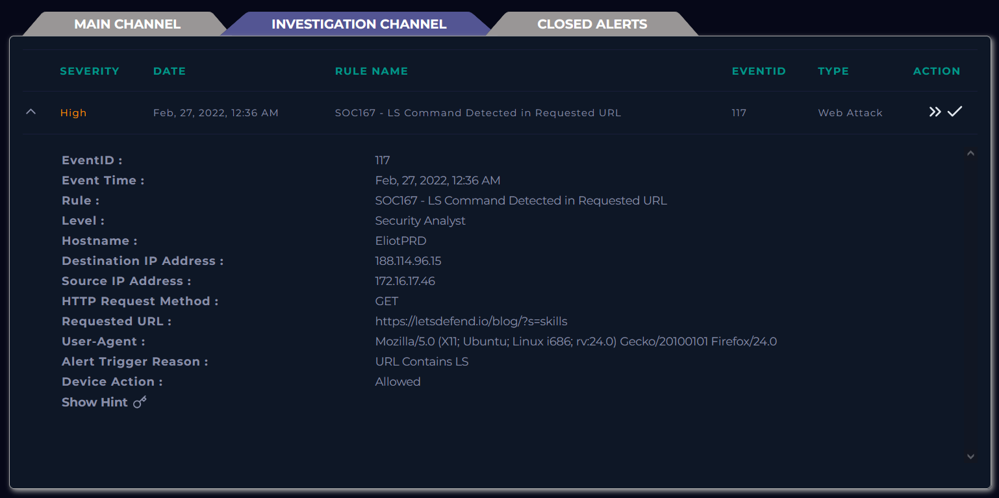
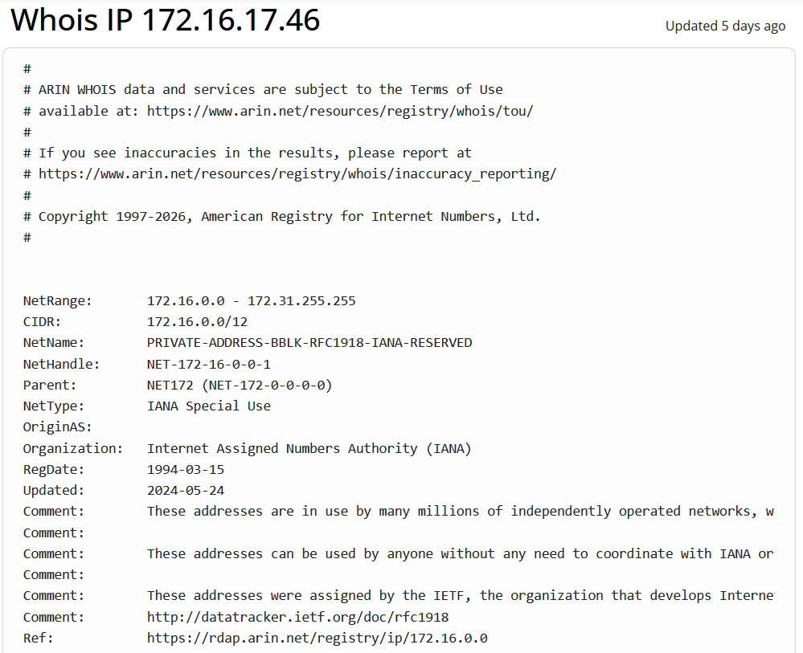
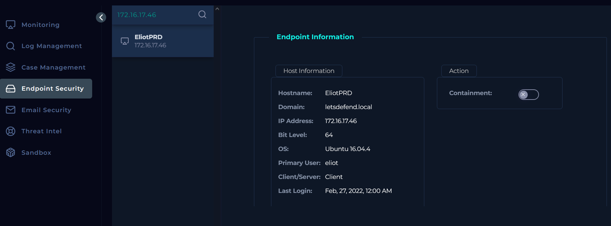
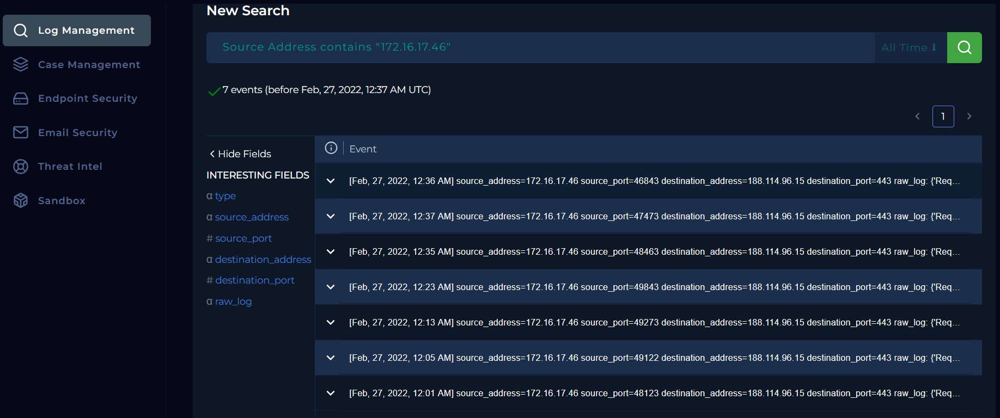
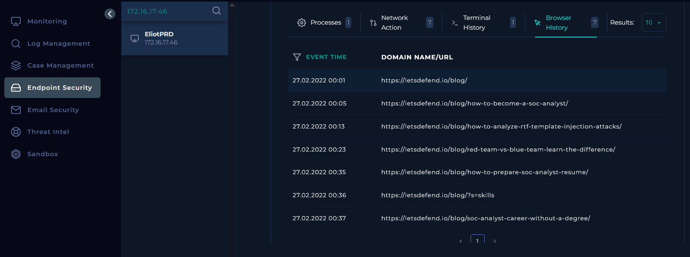

# 167-LS Command Detected in Requested URL — de la Alerta] — SOC Alert Writeup

<!-- Archivo: LD-YYYYMMDD-SOC-nombre-del-caso.md -->

---

## Metadata

| Campo | Valor |
|---|---|
| **Plataforma** | LetsDefend |
| **Categoría** | SOC Alert |
| **Alert ID** | 117 |
| **Regla disparada** | SOC167 - LS Command Detected in Requested URL |
| **Fecha de la alerta** | 2026-03-24 HH:MM UTC |
| **Fecha del análisis** | 2026-03-24 |
| **Severidad** | HIGH |
| **Veredicto final** | False Positive |
| **Escalado** | No |
| **Tiempo invertido** | ~30 min |

### Herramientas utilizadas

`LetsDefend Log Managment` · `LetsDefend Endpoint Security` · `WHOIS`

### MITRE ATT&CK

| ID | Técnica | Táctica |
|---|---|---|
| T1059 | Command and Scripting Interpreter | Execution |

**Nota Importante**
> La técnica fue asociada automaticamente por la regla de detección. Sin embargo, tras el análisis, no se encontraron evidencias que confirmen actividad maliciosa. El evento fue clasificado como falso positivo.
---

## Resumen Ejecutivo

El 27 de febrero de 2022, el sistema de supervisión de seguridad activó una alerta (ID de evento 117) debido a la detección de la cadena `ls` en una URL a la que se accedió desde el host interno `EliotPRD` (IP `172.16.17[.]46`).

Se llevó a cabo una revisión exhaustiva que incluyó:

- Los registros de red de la IP de origen
- La actividad de los terminales en EliotPRD
- El historial del navegador del usuario Eliot

El análisis confirmó que todo el tráfico corresponde a una navegación web legítima al dominio letsdefend.io, sin indicios de procesos maliciosos, comandos o conexiones anómalas.

---

## 1. Triage Inicial

### Información de la alerta

| Campo | Detalle |
|---|---|
| Dispositivo de origen | EliotPRD |
| IP de origen | 172.16.17[.]46 |
| IP de destino | 188.114.96[.]15 |
| Dominio de destino | `letsdefend.io` |
| Usuario involucrado | Eliot (no validado) |
| Proceso / Aplicación | Navegador Web (HTTPS/443) |
| Método HTTP | GET |
| URL solicitada | `https://letsdefend.io/blog/?s=skills` |
| User-Agent | Mozilla/5.0 (X11; Ubuntu; Linux i686; rv:24.0) Gecko/20100101 Firefox/24.0|
| Alert Trigger reason | URL Contains LS |
| Acción del dispositivo | Allowed | 
| Severidad | High |
| Timestamp | Feb, 27, 2022, 12:36 AM |


*Detalles del evento en Log Monitoring de LetsDefend*




### Primera hipótesis

El evento sugiere un posible intento de reconocimiento o enumeración web, donde la regla detecta la cadena `ls` en la URL. Dado que el parámetro observado `?s=skills` es consistente con búsquedas legitimas en sitios web, es probable que se trate de un falso positivo o tráfico benigno mal categorizado, más que una explotación activa.

---

## 2. Recolección de Evidencia

### Verificación de la IP de origen
El análisis de la dirección IP 172.16.17[.]46 mediante consulta WHOIS indica que pertenece al rango de direcciones IP privadas (RFC 1918), por lo que no es enrutable en internet y sugiere un origen interno dentro de la red corporativa. 
Adicionalmente, la busqueda en la herramienta de **Endpoint Security de LetsDefend** permitió identificar que dicha IP esta asociada al endopoint `EliotPRD`, perteneciente al dominio `letsdefend.local`, con el usuario principal `eliot`. 
Estos hallazgos confirman que la actividad se origina desde un **equipo internto legítimo**, lo cuál reduce la probabilidad de que se trate de un ataque externo directo.

#### Evidencias
*Verificación de IP en WHOIS*


*Revisión en Endpoint Security*


### Logs relevantes

```text
[LOG 1] Feb, 27, 2022, 12:35 AM
Request URL  : https://letsdefend.io/blog/how-to-prepare-soc-analyst-resume/
User-Agent   : Mozilla/5.0 (X11; Ubuntu; Linux i686; rv:24.0) Gecko/20100101 Firefox/24.0
Method       : GET
Response     : 200 — 3451 bytes
Device Action: Permitted


[LOG 2] Feb, 27, 2022, 12:36 AM
Request URL  : https://letsdefend.io/blog/?s=skills
User-Agent   : Mozilla/5.0 (X11; Ubuntu; Linux i686; rv:24.0) Gecko/20100101 Firefox/24.0
Method       : GET
Response     : 200 — 2577 bytes
Device Action: Permitted


[LOG 3] Feb, 27, 2022, 12:37 AM
Request URL  : https://letsdefend.io/blog/
soc-analyst-career-without-a-degree/
User-Agent   : Mozilla/5.0 (X11; Ubuntu; Linux i686; rv:24.0) Gecko/20100101 Firefox/24.0
Method       : GET
Response     : 200 — 4624 bytes
Device Action: Permitted
```

*Vista general de los logs*




## 3. Análisis

### 3.1 Análisis de red / tráfico

Se analizaron múttiples registros asociados a la IP de origen `172.16.17[.]46`, seleccionando los eventos mas representativos vistos en el apartado 2 de recolección de evidencias.
Estos registros evidencian una **secuencia coherente de navegación web** hacia el dominio `letsdefend.io`, incluyendo:
- Acceso a articulos específicos del blog.
- Uso de funcionalidad de búsqueda (`?s=skills`).
- Navegación entre páginas relacionadas.

Todos los eventos presentan:
- Método GET
- Respuesta HTTP 200 (OK)
- User-Agent consistente (Firefox en Linux)
- Acciones permitidas por el dispositivo de seguridad.

No se identificaron patrones asociados a automatización, enumeración maliciosa, inyección de comandos o alguna actividad anómala en la sesión. Lo que indica que corresponde a un tráfico consistente con actividad legitima de navegación de usuario.
### 3.2 Análisis de endpoint

Se realizó el análisis del endpoint `EliotPRD` asociado a la IP `172.16.17[.]46`, con el objetivo de identificar actividad sospechosa relacionada con la alerta.

#### Procesos (Processes)

La revisión de los procesos en ejecución no evidenció actividades anómalas ni procesos sospechosos asociados a ejecución de comandos o herramientas maliciosas.

#### Actividad de Red (Network Action)

Se identificaron 7 eventos de conexión hacia la dirección IP `188.114.96[.]15`, todos dentro de un intervalo corto de tiempo.

#### Historial de Terminal (Terminal History)

No se encontraron comandos ejecutados que estén relacionados con:

- Uso de ls
- Ejecución de comandos remotos
- Actividad sospechosa en shell

#### Historial del Navegador (Browser History)

El análisis del historial del navegador en el endpoint evidencia múltiples accesos al dominio `letsdefend.io`, incluyendo navegación entre diferentes artículos del blog y el uso de la funcionalidad de búsqueda `(?s=skills)`.

Esta actividad presenta una secuencia temporal coherente y coincide con los eventos registrados en los logs de red, lo que confirma que las solicitudes fueron generadas por interacción legítima del usuario.

Evidencia: *Historial de navegación del endpoint EliotPRD*



Esto correlaciona directamente con los logs de red analizados previamente, confirmando que la actividad fue generada por interacción legítima del usuario.


### 3.3 Correlación de eventos

Se analizaron eventos previos y posteriores asociados a la IP `172.16.17[.]46`, identificando múltiples solicitudes HTTP hacia el dominio `letsdefend.io` en un intervalo corto de tiempo.

Los eventos muestran:

- Navegación secuencial entre diferentes páginas del sitio
- Uso de funcionalidades web legítimas (búsqueda)
- Consistencia en User-Agent y comportamiento
- Ausencia de patrones anómalos (automatización, escaneo o explotación)

Adicionalmente, la actividad fue validada mediante el historial del navegador del endpoint `EliotPRD`, confirmando que las solicitudes fueron generadas por interacción directa del usuario.

---

## 4. Determinación del Veredicto

### ¿True Positive o False Positive?

**Veredicto:** False Positive

**Justificación:**

 La alerta fue generada por la detección de la cadena “ls” en la URL (?s=skills), lo que activó una regla basada en firmas asociada a posibles comandos del sistema. Sin embargo, el análisis de tráfico web evidenció una secuencia coherente de navegación hacia el dominio `letsdefend.io`, con respuestas HTTP 200 y un User-Agent consistente con un navegador legítimo. Adicionalmente, la revisión del endpoint EliotPRD no mostró evidencia de ejecución de comandos, actividad sospechosa en procesos, ni uso de terminal relacionado con la alerta. El historial del navegador confirmó que las solicitudes fueron generadas por interacción legítima del usuario. Por lo tanto, se concluye que la alerta corresponde a un falso positivo derivado de una coincidencia de patrón en la URL.

### Decisión de escalado

- No requiere escalado — caso cerrado

## 5. Hallazgos Clave

1. **Coincidencia de patrón en URL:**
La alerta fue generada por la presencia de la cadena “ls” dentro de un parámetro legítimo de búsqueda.

2. **Actividad consistente con navegación legítima:**
Los logs de red y el historial del navegador muestran una secuencia coherente de interacción del usuario con el sitio web.

3. **Ausencia de evidencia maliciosa en el endpoint:**
No se identificaron procesos, comandos o conexiones sospechosas que indiquen compromiso del sistema.

---

## 6. Lecciones Aprendidas

### Lo que funcionó
- Correlación efectiva entre logs de red y datos del endpoint.
- Uso del historial del navegador como evidencia clave.
- Validación de actividad desde múltiples fuentes.

### Gaps identificados
- Regla de detección demasiado genérica basada en coincidencia de string.
- Clasificación de severidad potencialmente sobredimensionada.

### Para investigar después
- Ajuste de reglas para evitar detección de cadenas dentro de parámetros legítimos.
- Implementación de validaciones adicionales (contexto de URL, encoding, etc.)

---

## Referencias

- [MITRE ATT&CK — Técnica](https://attack.mitre.org/techniques/TXXXX/)
- [VirusTotal](https://www.virustotal.com)
- [WHOIS](https://www.whois.com/whois/172.16.17.46)

