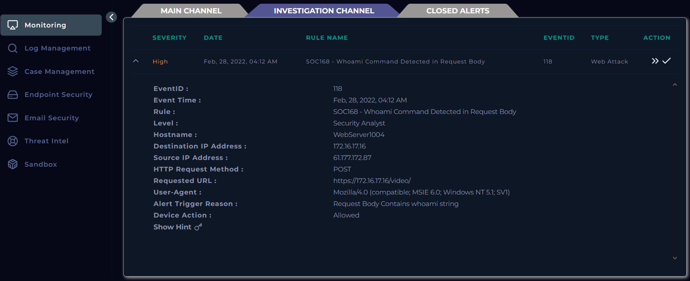
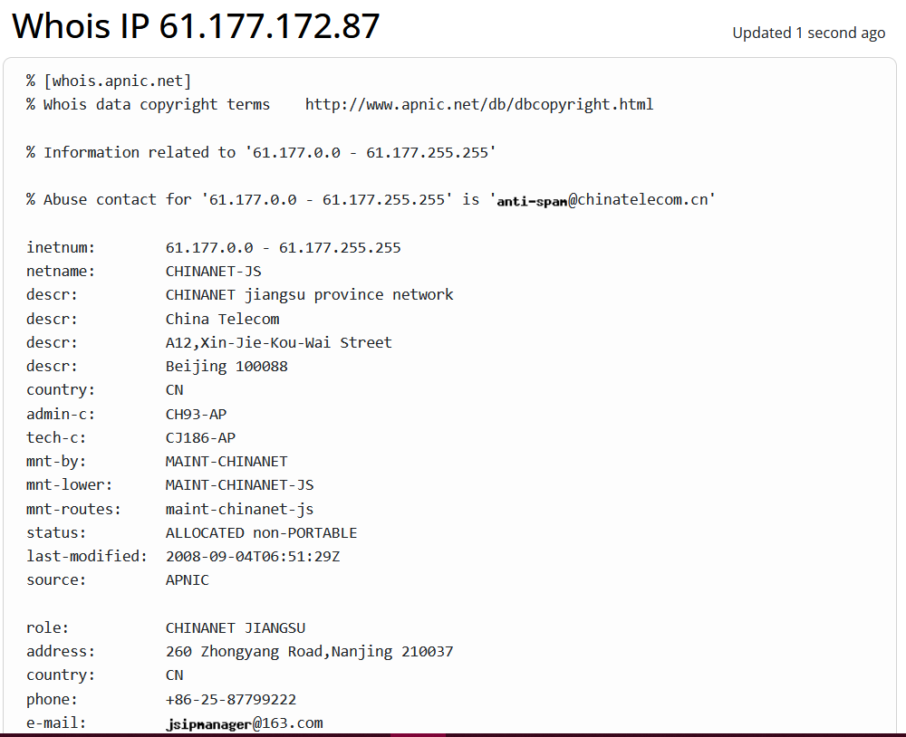
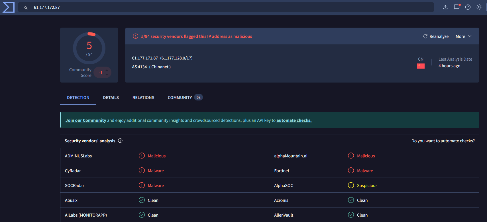
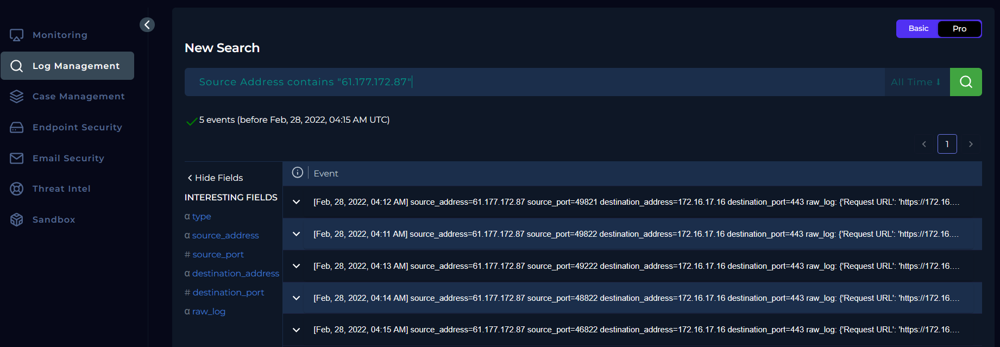
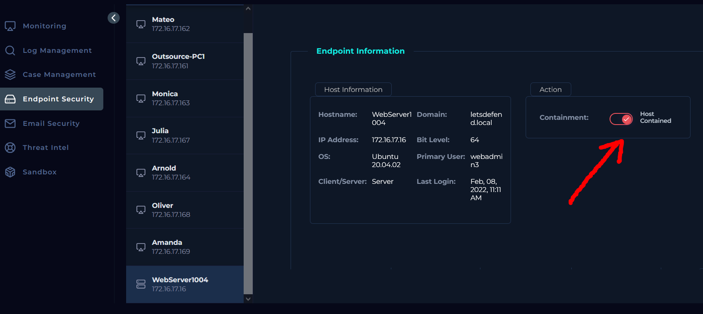

# 168 - Whoami Command Detected in Request Body — SOC Alert Writeup

<!-- Archivo: LD-YYYYMMDD-SOC-nombre-del-caso.md -->

---

## Metadata

| Campo | Valor |
|---|---|
| **Plataforma** | LetsDefend |
| **Categoría** | SOC Alert |
| **Alert ID** | 118 |
| **Regla disparada** | SOC168 - Whoami Command Detected in Request Body |
| **Fecha de la alerta** | Feb, 28, 2022, 04:12 AM |
| **Fecha del análisis** | 2026-03-25 |
| **Severidad** | HIGH |
| **Veredicto final** | True Positive / False Positive |
| **Escalado** | Sí |
| **Tiempo invertido** | ~45 min |

### Herramientas utilizadas

`LetsDefend Monitoring` · `LetsDefend Log Managment` · `LetsDefend Endpoint Security` · `WHOIS` · `VirusTotal`

### MITRE ATT&CK

| ID | Técnica | Táctica |
|---|---|---|
| T1059 | Command and Scripting Interpreter | Execution |

---

## Resumen Ejecutivo

Se detectó y confirmó un ataque exitoso de ejecución remota de comandos (RCE) contra un servidor web interno (`172.16.17.16`), originado desde una IP externa (`61.177.172[.]87`).

El atacante logró ejecutar múltiples comandos en el sistema, incluyendo acceso a archivos sensibles como `/etc/passwd` y `/etc/shadow`, lo que evidencia un compromiso del endpoint.

Como medida de respuesta, el dispositivo afectado fue aislado para contener la amenaza y prevenir su propagación. El incidente fue escalado a Tier 2 para un análisis más profundo del alcance del compromiso, incluyendo posible movimiento lateral y persistencia.

El incidente representa un riesgo alto para la organización debido al acceso no autorizado al sistema y a información sensible.

---

## 1. Triage Inicial

### Información de la alerta
| Campo |Detalle                                                             |
| --- | --- |
| Tipo de origen           | External (Untrusted Network)                                        |
| IP de origen             | `61.177.172[.]87`                                                   |
| IP de destino            | `172.16.17[.]16`                                                    |
| Host de destino          | `WebServer1004`                                                     |
| Dominio de destino       | `letsdefend.local` (resolución interna / enriquecido)               |
| Usuario asociado al host | webadmin3 (usuario asociado al endpoint, no observado en el evento) |
| Servicio afectado        | Web Server (HTTPS/443 - servicio expuesto)                          |
| Método HTTP              | POST                                                                |
| URL solicitada           | `https://172.16.17.16/video/`                                       |
| User-Agent               | Mozilla/4.0 (compatible; MSIE 6.0; Windows NT 5.1; SV1)             |
| Indicador detectado      | Request Body contains 'whoami'                                      |
| Tipo de actividad        | Posible Command Injection                                           |
| Acción del dispositivo   | Allowed                                                             |
| Severidad                | High                                                                |
| Timestamp                | Feb 28, 2022, 04:12 AM                                              |

#### Evidencia: *Registro del evento en Monitoring*


### Primera hipótesis

El evento sugiere un intento de explotación mediante inyección de comandos en una aplicación web expuesta, evidenciado por la presencia del comando `whoami` en el cuerpo de la solicitud HTTP. El tráfico proviene de una IP externa y fue permitido por el sistema, lo que podría indicar un intento de reconocimiento o validación de vulnerabilidades en el servidor web de destino. Se requiere verificar si el comando fue ejecutado exitosamente en el servidor y si existen indicadores de compromiso adicionales.

---

## 2. Recolección de Evidencia

### Verificación de la IP de origen
La ip `61.177.172[.]87` pertenece a un rango asignado a **China Telecom (CHINANET)**, especificamente a la region Jiangsu, China, según la consulta WHOIS.
No se identificó como infraestructura corporativa conocida o confiable, por lo que se le clasifica como origen externo no confiable.
Asimismo se consultó la reputación de la IP en fuentes de inteligencia (VirusTotal), obteniendo 5 detecciones sobre 94 motores, clasificandola como **malicious (múltiples vendors) y Suspicious**. Lo que sugiere que dicha IP a sido asociada a actividad maliciosa o sospechosa

#### Evidencias: 
*Resultados de la búsqueda de la IP en WHOIS*


*Consulta de la reputacion de la IP en VirusTotal*


### Logs relevantes

Se identificaron múltiples solicitudes HTTP POST desde la IP `61.177.172[.]87` dirigidas al endpoint `/video/`, todas con parámetros que sugieren ejecución remota de comandos.

```
[LOG 1] Feb, 28, 2022, 04:11 AM
Request URL  : https://172.16.17.16/video/
User-Agent   : Mozilla/4.0 (compatible; MSIE 6.0; Windows NT 5.1; SV1)
Method       : POST
Response     : 200 — 1021 bytes
Device Action: Permitted
POST Parameters: ?c=ls


[LOG 2] Feb, 28, 2022, 04:12 AM
Request URL  : https://172.16.17.16/video/
User-Agent   : Mozilla/4.0 (compatible; MSIE 6.0; Windows NT 5.1; SV1)
Method       : POST
Response     : 200 — 912 bytes
Device Action: Permitted
POST Parameters: ?c=whoami


[LOG 3] Feb, 28, 2022, 04:14 AM
Request URL  : https://172.16.17.16/video/
User-Agent   : Mozilla/4.0 (compatible; MSIE 6.0; Windows NT 5.1; SV1)
Method       : POST
Response     : 200 — 1321 bytes
Device Action: Permitted
POST Parameters: ?c=cat /etc/passwd
```

- Todas las solicitudes reciben respuestas `200 OK`, lo que indica que el servidor procesó correctamente las peticiones.
- Se observa variación en los tamaños de respuesta, lo que sugiere que los comandos ejecutados podrían estar generando salidas distintas.
- Los comandos utilizados (ls, whoami, uname, cat /etc/passwd) son consistentes con actividades de enumeración y reconocimiento en sistemas Linux.

#### Evidencias: *Vista general de los registros en Log Monitoring*


---

## 3. Análisis

### 3.1 Análisis de red / tráfico

| Timestamp | URL solicitada | Parámetro POST     | Código de respuesta | Tamaño de respuesta |
| --------- | -------------- | ------------------ | ------------------- | ---------------- |
| 04:12 AM  | `https://172.16.17.16/video/`        | ?c=ls              | 200 OK              | 1021             |
| 04:13 AM  | `https://172.16.17.16/video/`        | ?c=whoami          | 200 OK              | 912              |
| 04:14 AM  | `https://172.16.17.16/video/`        | ?c=uname           | 200 OK              | 910              |
| 04:15 AM  | `https://172.16.17.16/video/`        | ?c=cat /etc/passwd | 200 OK              | 1321             |
| 04:16 AM  | `https://172.16.17.16/video/`        | ?c=cat /etc/shadow | 200 OK              | 1501             |

Todas las solicitudes POST desde la IP externa `61.177.172[.]87` se dirigieron al endpoint `/video/`. Los comandos enviados (`ls`, `whoami`, `uname`, `cat /etc/passwd`, `cat /etc/shadow`) fueron procesados exitosamente, como lo indica el código `200 OK` y la variación en el tamaño de respuesta. Este patrón muestra un intento de enumeración y extracción de información sensible, consistente con un ataque de ejecución remota de comandos automatizado.

### 3.2 Análisis de endpoint

Se identificó la ejecución de múltiples comandos del sistema en el servidor `WebServer1004`, a través del endpoint web comprometido `/video/`.
Los comandos observados incluyen: ls, whoami, cat /etc/passwd, entro otros.

**Evidencia**: *Comandos ejecutados en el servidor `WebServer1004`*


Estos comandos fueron ejecutados exitosamente, corroborados mediante:
- Respuestas HTTP `200 OK`
- Variación en los tamaños de la respuesta.
- Validación directa en el host afectado.


### 3.3 Correlación de eventos

Se identificó una serie de solicitudes HTTP POST provenientes de la IP externa `61.177.172[.]87` hacia el endpoint `/video/` del servidor `172.16.17[.]16`.

La secuencia de comandos observada fue la siguiente:

| Orden | Comando | Descripción |
|---|---|---|
| 01 | `ls` | Enumeración inicial del sistema (listado de archivos y directorios). |
| 02 | `whoami` | Validación del usuario actual. |
| 03 | `uname` | Obtención de información del sistema. |
| 04 | `cat /etc/passwd` | Enumeración de usuarios. |
| 05 | `cat /etc/shadow` | Intento de acceso a credenciales. |

Todos los eventos:

- Se originan desde la misma IP externa.
- Se dirigen al mismo endpoint vulnerable.
- Ocurren en un corto intervalo de tiempo.
- Siguen una progresión lógica de reconocimiento a extracción de informació.

Por lo tanto, la secuencia observada es consistente con un intento de explotación de vulnerabilidad tipo Remote Command Execution (RCE), donde el atacante valida la ejecución de comandos y posteriormente realiza actividades de enumeración y acceso a información sensible.

El patrón indica un comportamiento estructurado, posiblemente manual, orientado a evaluar el nivel de acceso obtenido en el sistema comprometido.

---

## 4. Determinación del Veredicto

### ¿True Positive o False Positive?

**Veredicto:** True Positive 

**Justificación:**
Se confirmó actividad maliciosa desde la IP externa `61.177.172[.]87` contra el servidor interno `172.16.17.16`, donde se ejecutaron comandos del sistema (`ls`, `whoami`, `uname`, `cat /etc/passwd`, `cat /etc/shadow`) a través del endpoint `/video/`.

La ejecución fue exitosa, evidenciada por respuestas `200 OK`, variación en los tamaños de respuesta y validación directa en el endpoint comprometido. Esto confirma la explotación de una vulnerabilidad de ejecución remota de comandos (RCE).

### Decisión de escalado

- Escalado al Tier 2 — motivo: Confirmación de compromiso del endpoint y posible movimiento lateral o persistencia no evaluada.

---

## 5. Acciones de Contención
Se realizó el aislamiento del endpoint comprometido `172.16.17.16 (WebServer1004)` mediante la funcionalidad de `containment` del EDR (Endpoint Security en LetsDefend), con el objetivo de prevenir la propagación del ataque y limitar el acceso del atacante al sistema.

#### Evidencia: *Contención del endpoint comprometido `172.16.17.16 (WebServer1004)`*



## 6. Indicadores de Compromiso (IOCs)

| Tipo   | Valor                           | Contexto                                                |
| ------ | ------------------------------- | ------------------------------------------------------- |
| IP     | `61.177.172[.]87`               | IP externa origen del ataque con actividad maliciosa    |
| IP     | `172.16.17[.]16`                | Servidor interno comprometido                           |
| Domain | `letsdefend[.]local`            | Dominio interno del host afectado                       |
| URL    | `https://172.16.17[.]16/video/` | Endpoint vulnerable explotado mediante RCE              |
| URL    | `/video/`                       | Ruta específica utilizada para la inyección de comandos |


---

## 7. Hallazgos Clave

1. **Ejecución remota de comandos confirmada:** 
Se validó la ejecución de múltiples comandos en el endpoint, confirmando compromiso del sistema.

2. **Acceso a información sensible:**
El atacante logró acceder a archivos críticos como `/etc/passwd` y `/etc/shadow`.

3. **Patrón de ataque estructurado:** Se observó una secuencia lógica de comandos orientada a reconocimiento y enumeración del sistema.

---

## 8. Lecciones Aprendidas

### Lo que funcionó
- Identificación temprana de actividad sospechosa mediante alertas de seguridad.
- Capacidad de correlacionar eventos de red y endpoint.
- Contención rápida del dispositivo comprometido

### Gaps identificados
- Falta de bloqueo o detección temprana de payloads maliciosos en el servidor web
- La aplicación web vulnerable permitió ejecución directa de comandos sin validación.
- Tráfico malicioso fue permitido sin inspección efectiva.

### Para investigar después
- Posible movimiento lateral desde el host comprometido.
- Existencia de mecanismos de persistencia en el endpoint.
- Alcance del acceso a credenciales y posible reutilización.
- Revisión y parcheo de la vulnerabilidad en el endpoint `/video/`.

---

## Referencias

- [MITRE ATT&CK — Técnica T1059](https://attack.mitre.org/techniques/T1059/)
- [VirusTotal](https://www.virustotal.com/)
- [WHOIS](https://www.whois.com/)
