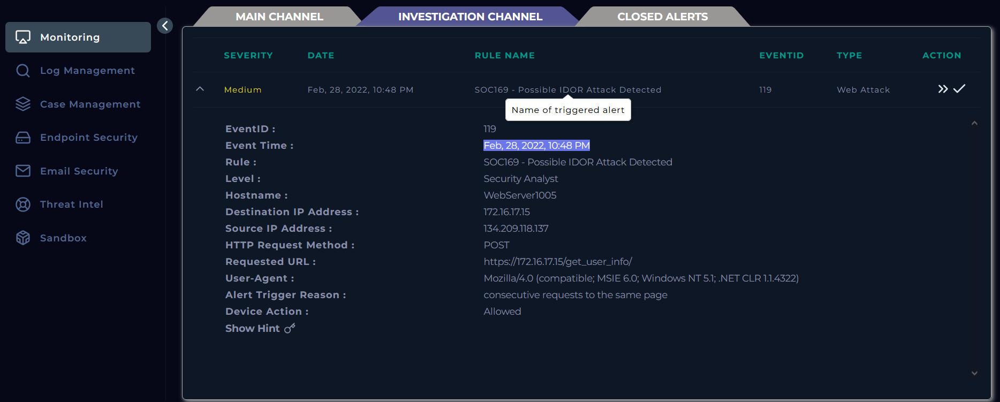
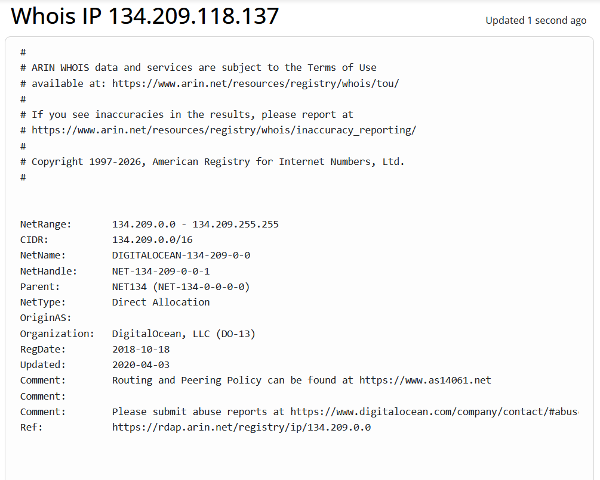
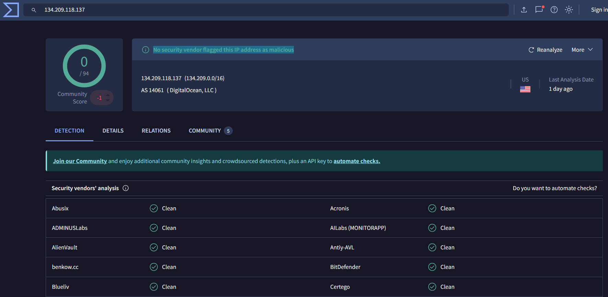
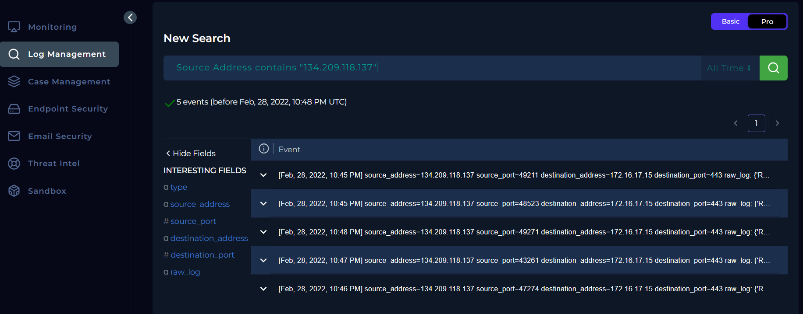

# 169 - Possible IDOR Attack Detected — SOC Alert Writeup

<!-- Archivo: LD-YYYYMMDD-SOC-nombre-del-caso.md -->

---

## Metadata

| Campo | Valor |
|---|---|
| **Plataforma** | LetsDefend |
| **Categoría** | SOC Alert |
| **Alert ID** | 119 |
| **Regla disparada** | SOC169 - Possible IDOR Attack Detected |
| **Fecha de la alerta** | Feb, 28, 2022, 10:48 PM |
| **Fecha del análisis** | 2026-03-26 |
| **Severidad** | MEDIUM |
| **Veredicto final** | True Positive |
| **Escalado** | Sí (Tier 2) |
| **Tiempo invertido** | ~35 min |

### Herramientas utilizadas

`LetsDefend Monitoring` · `LetsDefend Log Management` · `LetsDefend Endpoint Security` · `WHOIS` · `VirusTotal`

### MITRE ATT&CK

| ID | Técnica | Táctica |
|---|---|---|
| T1190 | Exploit Public-Facing Application | Initial Access |

---

## Resumen Ejecutivo

Una alerta SOC169 relacionada con un posible ataque IDOR fue disparada sobre el host `WebServer1005`. Durante el análisis se verificó que múltiples requests POST al endpoint `/get_user_info/` con distintos `user_id` retornaron respuestas `HTTP 200` con tamaños de respuesta variables, lo que indica exposición de datos de otros usuarios sin autorización. La IP origen pertenece a un proveedor de nube (DigitalOcean). La evidencia confirma que el ataque tuvo éxito, por lo que se determinó como **True Positive** y se recomienda escalado para contención y remediación.

---

## 1. Triage Inicial

### Información de la alerta

| Campo | Detalle |
|---|---|
| Tipo de origen |	External (Untrusted Network) |
| IP de origen | `134.209.118[.]137` |
| IP de destino | `172.16.17.15` |
| Host de destino |	`WebServer1005` (Host interno / enriquecido) |
| Dominio de destino | `letsdefend.local` (resolución interna / enriquecido) |
| Usuario asociado al host | `webadmin35` (usuario asociado al endpoint, no observado en el evento) |
| Servicio afectado | Web Server (HTTPS/443 - servicio expuesto) |
| Método HTTP |	POST |
| URL solicitada | `https://172.16.17[.]15/get_user_info/` |
| User-Agent | Mozilla/4.0 (compatible; MSIE 6.0; Windows NT 5.1; .NET CLR 1.1.4322) |
| Indicador detectado | Request Body contains 'whoami' |
| Tipo de actividad | Solicitudes consecutivas al endpoint `/get_user_info/` |
| Acción del dispositivo | Allowed |
| Severidad | MEDIUM |
| Timestamp | Feb, 28, 2022, 10:48 PM |


#### Evidencia: *Registro del evento en Monitoring*



### Primera hipótesis

La alerta sugiere actividad de acceso no autorizado desde la dirección IP `134.209.118[.]137`, a información de usuarios mediante el endpoint `/get_user_info/`. Se sospecha un ataque tipo IDOR automatizado desde una IP externa, con exposición de datos sensibles.

---

## 2. Recolección de Evidencia

### Verificación de la IP de origen
Según la consulta WHOIS con respecto a la dirección IP `134.209.118[.]137`, indica que se trata de un rango de IP propiedad de DigitalOcean, un proveedor de infraestructura en la nube, probablemente se trate de un VPS o un servidor temporal o un contenedor o droplet. Asimismo se consultó la reputación de la IP en fuentes de inteligencia (VirusTotal), donde ningún proveedor de seguridad marcó a esta IP como maliciosa, lo cual guarda relación con las características de una infraestructura multi-tenant y dinámico.

#### Evidencia: 
*Consulta de la IP 134.209.118[.]137 en WHOIS*



*Consulta de reputación de la IP en VirusTotal*


### Logs relevantes

```
[LOG 1] Feb, 28, 2022, 10:45 PM
Request URL  : https://172.16.17.15/get_user_info/
User-Agent   : Mozilla/4.0 (compatible; MSIE 6.0; Windows NT 5.1; .NET CLR 1.1.4322)
Method       : POST
Response     : 200 — 188 bytes
Device Action: Permitted
POST Parameters: ?user_id=1


[LOG 2] Feb, 28, 2022, 10:45 PM
Request URL  : https://172.16.17.15/get_user_info/
User-Agent   : Mozilla/4.0 (compatible; MSIE 6.0; Windows NT 5.1; .NET CLR 1.1.4322)
Method       : POST
Response     : 200 — 253 bytes
Device Action: Permitted
POST Parameters: ?user_id=2


[LOG 3] Feb, 28, 2022, 10:46 PM
Request URL  : https://172.16.17.15/get_user_info/
User-Agent   : Mozilla/4.0 (compatible; MSIE 6.0; Windows NT 5.1; .NET CLR 1.1.4322)
Method       : POST
Response     : 200 — 351 bytes
Device Action: Permitted
POST Parameters: ?user_id=3
```
#### Evidencia: *Registros en Log Management*


---

## 3. Análisis

### 3.1 Análisis de red / tráfico

| Timestamp | URL Solicitado | Parámetro de POST | Código de Respuesta | Tamaño de respuesta |
|---|---|---|---|---|
| 10:45 PM | `https://172.16.17[.]15/get_user_info/` | `?user_id=1` | 200 | 188 |
| 10:45 PM | `https://172.16.17[.]15/get_user_info/` | `?user_id=2` | 200 | 253 |
| 10:46 PM | `https://172.16.17[.]15/get_user_info/` | `?user_id=3` | 200 | 351 |
| 10:47 PM | `https://172.16.17[.]15/get_user_info/` | `?user_id=4` | 200 | 158 |
| 10:48 PM | `https://172.16.17[.]15/get_user_info/` | `?user_id=5` | 200 | 267 |

Todas las solicitudes `POST` desde la IP externa `134.209.118[.]137` se dirigieron al endpoint `get_user_info`. Los parametros post enviados (`?user_id=1, ?user_id=2, ...`) fueron procesados exitosamente como lo indica el código `200` y la variación del tamaño de respuesta para cada solicitud. Este patrón muestra un intento de enumeración de IDs secuencialmente, característico de un ataque que vulnera el acceso directo a objetos internos del servidor web.

### 3.2 Análisis de endpoint
- No se observaron procesos extraños ni artefactos de persistencia.
- Actividad limitada a solicitudes POST automatizadas hacia `/get_user_info/`.

### 3.3 Correlación de eventos

**Antes de la alerta:** No hubo eventos previos inmediatos que indicaran una explotación de la vulnerabilidad IDOR. Sin embargo, el tráfico observado muestra un patrón automatizado, sugiriendo que el atacante ya había identificado el endpoint vulnerable.

**Después de la alerta:** Las solicitudes **POST** fueron realizadas en un corto intervalo de tiempo (aproximadamente 3 minutos), lo que indica que se trataba de un ataque automatizado. No se observaron otros movimientos maliciosos en la red ni escalamiento de privilegios, pero el atacante pudo acceder a datos de usuarios.

**Patrón de explotación:** La secuencialidad en los `user_id`, la respuesta `200 - OK` de lado del servidor y  la variación en los tamaños de respuesta confirma que la explotación fue exitosa para acceder a información de usuarios sin autorización.

---

## 4. Determinación del Veredicto

### ¿True Positive o False Positive?

**Veredicto:** True Positive

**Justificación:**
Las solicitudes POST enumerando `user_id` retornaron datos distintos para cada usuario sin autenticación válida. La evidencia confirma exposición de información sensible a un actor externo, lo que valida que la alerta fue correcta.

### Decisión de escalado

- Escalado a Tier 2 — motivo: Exposición de datos de usuarios y riesgo de exfiltración.


---

## 5. Acciones de Contención
Se realizó el aislamiento del endpoint comprometido `172.16.17.15 (WebServer1005)` mediante la funcionalidad de **containment** del EDR (Endpoint Security en LetsDefend), con el objetivo de prevenir el escalamiento y limitar el acceso del atacante al sistema.

#### Evidencia: *Contención del endpoint comprometido 172.16.17.15(WebServer1005)*
!(host-contained)(./screenshots-SOC169/05-host-contained.PNG)

---

## 6. Indicadores de Compromiso (IOCs)

| Tipo | Valor | Contexto |
|---|---|---|
| IP | `134.209.118[.]137` | Origen de requests POST al endpoint |
| URL | `https://172.16.17[.]15/get_user_info/` | Endpoint afectado |
| Método HTTP | POST | Enumeración de `user_id` |
| User-Agent | Mozilla/4.0 (compatible; MSIE 6.0; Windows NT 5.1; .NET CLR 1.1.4322) | Bot / automatización |

> No se detectaron archivos maliciosos ni dominios externos involucrados.
---

## 7. Hallazgos Clave

1. Acceso no autorizado a datos de usuarios vía IDOR en `/get_user_info/`.

2. Patrón automatizado de requests con múltiples `user_id` confirmando explotación.

3. Tráfico proveniente de IP externa en infraestructura cloud (Internet → Company Network).

---

## 8. Lecciones Aprendidas

### Lo que funcionó
- La alerta SOC169 detectó correctamente el comportamiento de enumeración de usuarios.
- Logs de la aplicación y Endpoint Security permitieron correlar la actividad.

### Gaps identificados
- Falta de controles de acceso en la aplicación.
- Ausencia de rate limiting en el endpoint `/get_user_info/`.

### Para investigar después
- Revisar si otros endpoints presentan fallas de IDOR similares.
- Implementar mitigación y controles de acceso robustos.
---

## Referencias

- [MITRE ATT&CK — Técnica](https://attack.mitre.org/techniques/TXXXX/)
- [VirusTotal](https://www.virustotal.com)
- [WHOIS](https://www.whois.com/whois/)
