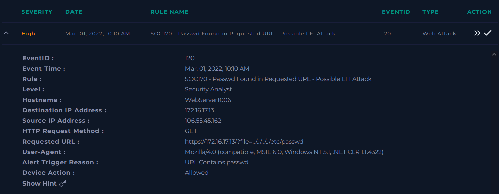
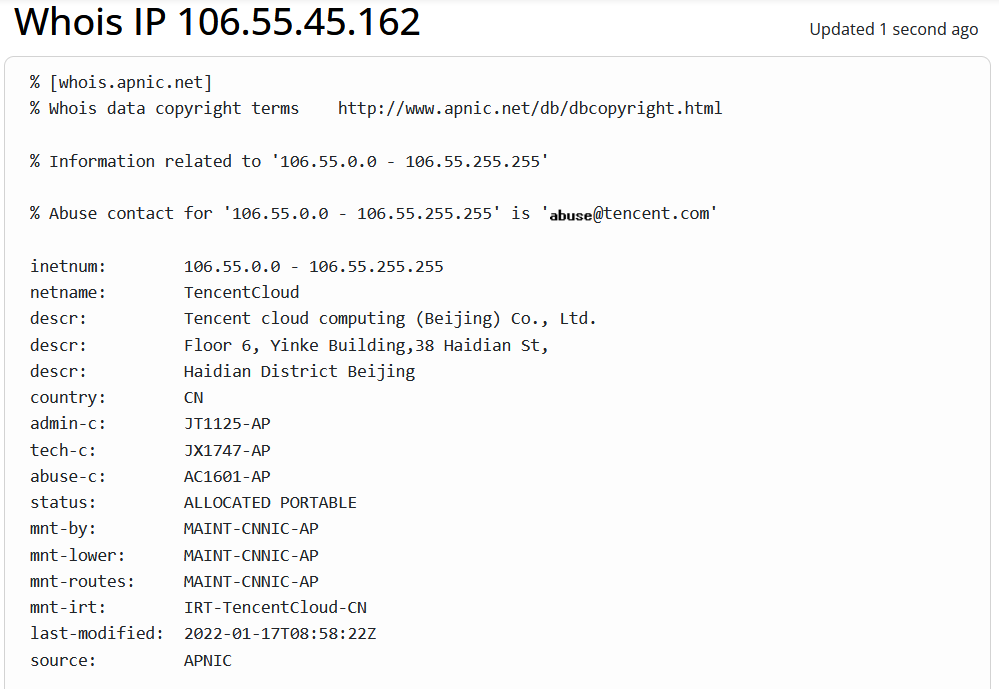

# 170-Passwd Found in Requested URL - Possible LFI Attack — SOC Alert Writeup

<!-- Archivo: LD-YYYYMMDD-SOC-nombre-del-caso.md -->

---

## Metadata

| Campo | Valor |
|---|---|
| **Plataforma** | LetsDefend |
| **Categoría** | SOC Alert |
| **Alert ID** | 120 |
| **Regla disparada** | SOC170 - Passwd Found in Requested URL - Possible LFI Attack |
| **Fecha de la alerta** | Mar, 01, 2022, 10:10 AM |
| **Fecha del análisis** | 2026-03-30 |
| **Severidad** | HIGH |
| **Veredicto final** | True Positive |
| **Escalado** | No |
| **Tiempo invertido** | ~30 min |

### Herramientas utilizadas

`LetsDefend Monitoring` · `LetsDefend Log Management` · `LetsDefend Endpoint Security` · `WHOIS` · `VirusTotal`

### MITRE ATT&CK

| ID | Técnica | Táctica |
|---|---|---|
| T1190  | Exploit Public-Facing Application | Initial Access |

---

## Resumen Ejecutivo

Se identificó un intento de explotación dirigido a un servidor web interno (WebServer1006) desde una dirección IP externa (`106.55.45[.]162`), mediante el uso de una solicitud HTTP manipulada que buscaba acceder a archivos sensibles del sistema.

La actividad es consistente con técnicas de exploración y posible explotación de aplicaciones web expuestas. No obstante, el intento no tuvo éxito, ya que el servidor respondió con un error interno (HTTP 500) sin retornar contenido, y no se evidenció actividad sospechosa adicional en el endpoint ni en la red.

Con base en la información analizada, se concluye que se trató de un intento malicioso sin compromiso del sistema. Se recomienda reforzar los controles de validación de entradas en la aplicación web y considerar la implementación de mecanismos adicionales de protección, como un WAF, para mitigar este tipo de intentos en el futuro.

---

## 1. Triage Inicial

### Información de la alerta

| Campo | Detalle |
|---|---|
| Tipo de origen |	External (Untrusted Network) |
| IP de origen | `106.55.45[.]162` |
| IP de destino | `172.16.17.13` |
| Host de destino |	`WebServer1006` (Host interno / enriquecido) |
| Dominio de destino | `letsdefend.local` (resolución interna / enriquecido) |
| Usuario asociado al host | `webadmin11` (usuario asociado al endpoint, no observado en el evento) |
| Servicio afectado | Web Server (HTTPS/443 - servicio expuesto) |
| Método HTTP |	GET |
| URL solicitada | `https://172.16.17[.]13/?file=../../../../etc/passwd` |
| User-Agent | Mozilla/4.0 (compatible; MSIE 6.0; Windows NT 5.1; .NET CLR 1.1.4322) |
| Indicador detectado | URL Contains passwd |
| Tipo de actividad | Petición HTTP donde se envía un parámetro que contiene una ruta hacia un archivo del sistema llamdo `/etc/passwd` |
| Acción del dispositivo | Allowed |
| Severidad | HIGH |
| Timestamp | Mar, 01, 2022, 10:10 AM |

*Detalles del evento en Monitoring*



### Primera hipótesis

Con base en la presencia de secuencias de **transversal de directorios**  `../../../../` en la URL solicitada desde la dirección IP `106.55.45[.]162` hacia el servidor web `WebServer1006`, se plantea que la actividad podría corresponder a un intento de acceso no autorizado a archivos internos del sistema mediante manipulación de parámetros en una aplicación web expuesta. La referencia al archivo `/etc/passwd` sugiere un posible intento de enumeración de usuarios o acceso a información sensible del sistema.

---

## 2. Recolección de Evidencia

### Verificación de la IP de origen
La consulta WHOIS indica que la dirección IP `106.55.45[.]162` se encuentra asociada a **Tencent Cloud**, con asignación en Beijing, China. No se identificó como infraestructura corporativa conocida o de confianza, por lo que se le clasifica como origen externo no confiable. 
Asimismo, se consultó la reputación  de la IP en VirusTotal, otbteniendo un resultado 0/94 detecciones aunque se observan algunos votos que la asocian a actividad maliciosa o sospechosa. 
Dado estos resultados, no es posible establecer una reputación concluyente para la dirección IP, esto se debe a que pertenece a un entorno cloud multi-tenant y dinámico, donde múltiples usuarios pueden compartir rangos de direcciones IP, limitando la atribución directa de actividad maliciosa.

*Consulta WHOIS a la dirección IP 106.55.45[.]162*




### Logs relevantes

```
[LOG 1] Feb, 28, 2022, 10:45 PM
Request URL  : https://172.16.17[.]13/?file=../../../../etc/passwd
User-Agent   : Mozilla/4.0 (compatible; MSIE 6.0; Windows NT 5.1; .NET CLR 1.1.4322)
Method       : GET
Response     : 500 — 0 bytes
Device Action: Permitted
```

## 3. Análisis

### 3.1 Análisis de red / tráfico

Se observa una única conexión entrante desde la dirección IP externa `106.55.45[.]162` hacia el servidor interno `172.16.17[.]13` a través del puerto 443 (HTTPS), correspondiente a un servicio web expuesto.

La solicitud HTTP contiene un parámetro manipulado `(file=../../../../etc/passwd)`, lo que sugiere un intento de acceso a archivos internos mediante técnicas de path traversal.

La respuesta del servidor presenta un código **500 (Internal Server Error)** con un tamaño de respuesta de **0 bytes**, lo que indica que la solicitud no fue procesada correctamente.

No se identificaron conexiones salientes posteriores desde el servidor hacia la IP de origen ni hacia otros destinos externos, ni tampoco actividad de red anómala (como uso de puertos inusuales o transferencias de datos significativas).

Con base en lo anterior, no hay evidencia de exfiltración de datos ni establecimiento de comunicación adicional.

### 3.2 Análisis de endpoint

Se realizó revisión del endpoint WebServer1006 mediante la herramienta de seguridad disponible, sin identificar ejecución de procesos sospechosos asociados al evento.

Asimismo, no se observaron:

- Comandos inusuales en el historial de terminal
- Actividad sospechosa en el historial de navegación
- Mecanismos de persistencia (tareas programadas, servicios, modificaciones relevantes)

No se encontraron evidencias de ejecución de código ni de compromiso del sistema derivado del evento analizado.

### 3.4 Correlación de eventos

No se identificaron eventos adicionales relacionados antes o después de la alerta que indiquen una secuencia de ataque más amplia.
La actividad observada corresponde a un evento aislado, sin repetición de intentos desde la misma IP ni variaciones en los payloads utilizados.
Tampoco se correlaciona con otras alertas de seguridad en el mismo host o en la red durante el periodo analizado.

---

## 4. Determinación del Veredicto

### ¿True Positive o False Positive?

**Veredicto:** True Positive

**Justificación:**
La solicitud HTTP contiene un patrón claro de manipulación de rutas `(../../../../)` orientado a acceder al archivo /etc/passwd, lo cual es consistente con técnicas conocidas de explotación de aplicaciones web.
Aunque no se evidencia compromiso exitoso (debido a la respuesta 500 y ausencia de actividad posterior), la intención maliciosa del tráfico es clara, por lo que el evento se clasifica como un intento de explotación real y no como un falso positivo.

### Decisión de escalado

- No requiere escalado — caso cerrado

---

## 5. Indicadores de Compromiso (IOCs)

| Tipo               | Valor                                                                                                      | Contexto                              |
| ------------------ | ---------------------------------------------------------------------------------------------------------- | ------------------------------------- |
| IP                 | `106.55.45[.]162`                                                                                            | Origen de la solicitud maliciosa      |
| Domain             | letsdefend.local                                                                                           | Dominio interno del servidor afectado |
| URL                | `https://172.16.17[.]13/?file=../../../../etc/passwd` | Intento de path traversal             |

---

## 6. Hallazgos Clave

1. **Intento de explotación web:** Se identificó una solicitud con manipulación de rutas dirigida a acceder a archivos sensibles del sistema.
2. **Fallo en la ejecución del ataque:** La respuesta HTTP 500 y el tamaño de respuesta 0 indican que el intento no fue procesado correctamente por el servidor.
3. **Ausencia de compromiso posterior:** No se detectó actividad sospechosa en red ni en el endpoint que sugiera explotación exitosa o persistencia.

---

## 7. Lecciones Aprendidas

### Lo que funcionó
- Detección efectiva de patrones maliciosos en solicitudes HTTP
- Capacidad de monitoreo del endpoint para descartar compromiso
- Visibilidad del tráfico de red entrante hacia servicios expuestos

### Gaps identificados
- El servidor respondió con error 500, lo que podría indicar:
    - manejo inadecuado de errores.
    - potencial superficie de ataque no completamente validada.
- Falta de validación robusta de entradas en la aplicación web.

### Para investigar después
- Revisar controles de validación de input en la aplicación web
- Implementar o ajustar reglas en WAF para bloquear intentos de path traversal
- Evaluar logs adicionales del servidor web (Apache/Nginx) para mayor visibilidad

---

## Referencias

- [MITRE ATT&CK — Técnica T1190](https://attack.mitre.org/techniques/T1190/)
- [VirusTotal](https://www.virustotal.com)
- [WHOIS](https://www.whois.com/whois/106.55.45.162)
